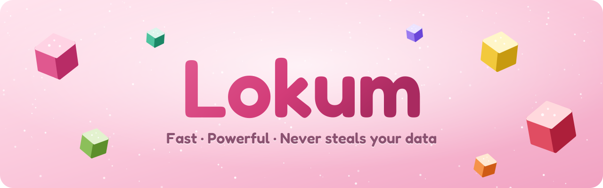

<p align="center">
  
</p>

<p align="center">
  <b>English</b> ·
  <a href="docs/i18n/README.tr.md">Türkçe</a> ·
  <a href="docs/i18n/README.de.md">Deutsch</a> ·
  <a href="docs/i18n/README.fr.md">Français</a> ·
  <a href="docs/i18n/README.it.md">Italiano</a> ·
  <a href="docs/i18n/README.rm.md">Rumantsch</a> ·
  <a href="docs/i18n/README.es.md">Español</a> ·
  <a href="docs/i18n/README.sv.md">Svenska</a> ·
  <a href="docs/i18n/README.ko.md">한국어</a> ·
  <a href="docs/i18n/README.ja.md">日本語</a> ·
  <a href="docs/i18n/README.zh-CN.md">简体中文</a> ·
  <a href="docs/i18n/README.zh-TW.md">繁體中文</a>
</p>

<p align="center">
  <a href="https://github.com/SametEge/Lokum/releases/latest"></a>
  <a href="https://github.com/SametEge/Lokum/releases"></a>
  
  
  <a href="LICENSE"></a>
</p>

**Lokum** is a web browser built on Mozilla Firefox and flavored like Turkish
delight. It takes the engine, security and extensions you already trust and
wraps them in an Arc‑style sidebar, twelve hand‑mixed color "flavors",
Spaces, a command palette, gentle animations and an unusually detailed
first‑run experience — in twelve languages. It updates itself from GitHub
Releases, quietly, the moment a new version is ready.

<p align="center">
  
  
</p>

---

## Contents

- [Download](#download)
- [Highlights](#highlights)
- [Flavors](#flavors)
- [Layouts: sidebar or classic tabs](#layouts-sidebar-or-classic-tabs)
- [Spaces](#spaces)
- [Command palette and command bar](#command-palette-and-command-bar)
- [Tabs that tidy themselves](#tabs-that-tidy-themselves)
- [The welcome tour](#the-welcome-tour)
- [Settings](#settings)
- [Privacy](#privacy)
- [Languages](#languages)
- [Automatic updates](#automatic-updates)
- [Keyboard shortcuts](#keyboard-shortcuts)
- [Installing](#installing)
- [Building from source](#building-from-source)
- [How Lokum works](#how-lokum-works)
- [Releases and continuous integration](#releases-and-continuous-integration)
- [FAQ](#faq)
- [Contributing](#contributing)
- [License and trademarks](#license-and-trademarks)

---

## Download

Grab the newest version from the **[Releases page](https://github.com/SametEge/Lokum/releases/latest)**.

| File | For | Notes |
| --- | --- | --- |
| `Lokum-Setup-<version>-x64.exe` | Windows 10 / 11 (64‑bit) | **Recommended.** Installs for your user only, no administrator rights needed, updates itself. |
| `Lokum-<version>-win64.zip` | Windows, portable | Unzip anywhere (even a USB stick) and run `lokum.exe`. Tells you about updates. |
| `Lokum-<version>-linux-x86_64.tar.xz` | Linux (64‑bit) | Extract and run `./lokum`; `install-desktop-entry.sh` adds it to your app menu. |
| `latest.json`, `SHA256SUMS.txt` | Everyone | Update manifest used by the built‑in updater and SHA‑256 checksums of every file. |

> **Windows SmartScreen.** Lokum is not code‑signed yet (certificates are
> expensive for a hobby project), so Windows may say *"Windows protected your
> PC"* the first time. Click **More info → Run anyway**. You can always check
> the file against `SHA256SUMS.txt` on the release page.

---

## Highlights

- 🍬 **Twelve flavors** — every theme is a kind of lokum: Rose, Pistachio, Lemon, Pomegranate, Orange, Mint, Lavender, Mastic, Coconut, Turkish Coffee, Midnight and an animated *Assorted* box. Each has a light and a dark recipe.
- 🧭 **Arc‑style sidebar _or_ classic tabs** — choose a full‑height sidebar with the address bar inside it, Firefox's vertical tabs, or the classic tab strip. Switch any time; the window rearranges itself live.
- 🗂️ **Spaces** — separate Personal, Work, School and Fun, each with its own tabs, icon, flavor and (optionally) container. Swipe or press <kbd>Ctrl</kbd>+<kbd>Alt</kbd>+<kbd>←</kbd>/<kbd>→</kbd> to switch.
- ⌨️ **Command palette** (<kbd>Ctrl</kbd>+<kbd>K</kbd>) — fuzzy search across open tabs and 40+ actions, and a big **floating command bar** when you focus the address bar.
- 🎵 **Mini player** — play/pause, skip and mute music or videos from other tabs right in the sidebar.
- 🧹 **Self‑tidying tabs** — auto‑archive tabs you have not opened for a while, put background tabs to sleep, and reopen anything from the Archive.
- 🌟 **A welcome tour like no other** — pick your flavor by dropping sugar‑dusted 3D lokum cubes, watch the browser re‑arrange behind the wizard, create Spaces from presets, import your old browser and choose your privacy level. Confetti included.
- ⚙️ **A settings page that is a joy** — twelve sections, instant search, live previews, export/import of your Lokum settings.
- 🔒 **Private by default** — no telemetry, no studies, no sponsored content; strict tracking protection one click away; uBlock Origin, Secure DNS, HTTPS‑Only, GPC and fingerprinting protection built into the settings.
- 🌍 **Twelve languages** — English, Turkish, German, French, Italian, Romansh, Spanish, Swedish, Korean, Japanese, Simplified and Traditional Chinese, for both Lokum and Firefox itself.
- 🔄 **Automatic updates** — new releases are built by GitHub Actions on every change and whenever Mozilla ships a new Firefox, then installed silently when you close Lokum.
- 🦊 **Real Firefox inside** — official Mozilla builds, the Gecko engine, every Firefox add‑on, Firefox Sync, and Mozilla's security fixes as soon as they ship.

---

## Flavors

A flavor colors the whole browser: the window frame, the sidebar, the accent
color of buttons and toggles, the new tab page and Lokum's own pages. Each
flavor has a light and a dark recipe, and you can override the accent with any
color you like. Spaces can have their own flavor, so the window changes color
when you switch space.

| | Flavor | Mood |
| --- | --- | --- |
| 🌹 | **Rose** (Gül) | The classic rosewater delight, blushing pink. *(default)* |
| 🌰 | **Pistachio** (Fıstık) | Fresh pistachio green, calm and focused. |
| 🍋 | **Lemon** (Limon) | Sunny lemon zest for bright mornings. |
| 🍎 | **Pomegranate** (Nar) | Deep pomegranate red, bold and juicy. |
| 🍊 | **Orange** (Portakal) | Warm orange and bergamot glow. |
| 🌿 | **Mint** (Nane) | Cool mint, crisp like a spring breeze. |
| 💜 | **Lavender** (Lavanta) | Soft lavender for dreamy afternoons. |
| 🤍 | **Mastic** (Sakız) | Creamy mastic ivory, quiet and elegant. |
| 🥥 | **Coconut** (Hindistan cevizi) | Coconut white, clean and minimal. |
| ☕ | **Turkish Coffee** (Kahve) | Rich Turkish coffee browns. |
| 🌙 | **Midnight** (Gece) | Starry midnight plum for night owls. |
| 🎨 | **Assorted** (Karışık) | A box of assorted delights that slowly drifts through every color. |

Every palette is checked by the test suite: text must reach a WCAG contrast of
4.5:1 on its frame and accent buttons 3:1 in both light and dark mode.

Extra touches you can switch on or off: **powdered sugar** (tiny sparkles that
twinkle in the sidebar), **soft grain** (a subtle paper texture), rounded page
corners, frame spacing, page shadow, interface density (compact / normal /
comfy), interface font (system / rounded / serif) and three animation levels
(full, reduced — colors fade but nothing moves — or off). Lokum also respects
your system's *reduce motion* setting.

<p align="center">
  
</p>

---

## Layouts: sidebar or classic tabs

| Layout | What it looks like |
| --- | --- |
| **Sidebar (Arc style)** *(default)* | Tabs, the address bar and the navigation buttons live in one full‑height sidebar. The page floats on your flavor as a rounded card, with a slim title strip above it showing the page title, the site and a *copy link* button. |
| **Vertical tabs** | Firefox's native vertical tabs in a sidebar, with the address bar on top. Familiar and roomy. |
| **Classic tabs** | Tabs across the top, like every browser you know — still dressed in your flavor. |

<p align="center">
  
</p>

More layout options:

- **Sidebar side** — left or right.
- **Hide sidebar (compact mode)** — <kbd>Ctrl</kbd>+<kbd>Alt</kbd>+<kbd>S</kbd>. The page takes the whole window and the sidebar slides in when your pointer touches the window edge.
- **Floating command bar** — the address bar opens big and centered over the page, like Arc.
- **New tabs appear** at the top or the bottom of the list.
- **Tab close button** on hover, always or never.
- **Pinned tabs become favorites** — a grid of big icons at the top of the sidebar that stays the same in every Space.
- **Bookmarks toolbar**, **mini player** and **toolbar customization**.

---

## Spaces

Spaces keep the different parts of your life apart. Every Space has its own
list of tabs, a name, an emoji icon, an optional flavor that recolors the window
while you are in it, and an optional Firefox **container** so that, for
example, your Work space stays logged in to your work accounts.

- Switch with the icons at the bottom of the sidebar, by **swiping sideways** on the sidebar (or <kbd>Shift</kbd> + mouse wheel), with <kbd>Ctrl</kbd>+<kbd>Alt</kbd>+<kbd>←</kbd>/<kbd>→</kbd>, or jump straight to one with <kbd>Ctrl</kbd>+<kbd>Alt</kbd>+<kbd>1</kbd>…<kbd>9</kbd>.
- **Drag a tab onto a Space icon** to move it there, or use *Move to space* in the tab's context menu.
- Right‑click the Space name to rename it, change its icon, flavor or container, clear its tabs, or create and delete Spaces.
- Manage everything — including the order — in **Settings → Spaces**.
- Spaces are saved in your profile (`lokum/spaces.json`) and every tab remembers its Space across restarts.

<p align="center">
  
</p>

---

## Command palette and command bar

Press <kbd>Ctrl</kbd>+<kbd>K</kbd> anywhere. Type a few letters and Lokum finds
open tabs and actions with fuzzy matching: new tab/window/private window,
reopen closed tab, duplicate, pin, copy link, **split view** with the last tab,
reader view, Picture‑in‑Picture, screenshot, find, print, zoom, downloads,
history, bookmarks, extensions, developer tools, clear recent history, dark
mode, every layout, every flavor, every Space and Lokum or Firefox settings.
Anything else becomes a web search.

<p align="center">
  
  
</p>

When you click the address bar (or press <kbd>Ctrl</kbd>+<kbd>L</kbd>) in the
sidebar layout, it grows into a large **floating command bar** in the middle of
the window — all of Firefox's suggestions, search shortcuts and history, with
room to breathe.

---

## Tabs that tidy themselves

- **Auto‑archive** — unpinned tabs you have not opened for 12 hours, a day, a week or a month are closed and kept in the **Archive** (up to 600 tabs). Search it and reopen anything in **Settings → Archive** or from the library button in the sidebar.
- **Sleeping tabs** — background tabs can be unloaded after a number of minutes to save memory and battery; they come back when you click them.
- **Mini player** — when a tab is playing media, a small card in the sidebar shows the artwork, title and artist with previous / play‑pause / next and mute.
- Plus everything Firefox brings: **tab groups**, **split view**, tab previews on hover, automatic **Picture‑in‑Picture**, and session restore.

---

## The welcome tour

The first time you start Lokum, a full‑screen welcome tour opens over the
browser — and the browser changes live behind it as you choose.

<p align="center">
  
  
</p>

1. **Welcome** — a floating 3D lokum cube, drifting sugar and a language switcher.
2. **Flavor** — twelve sugar‑dusted cubes drop into a tray; tap one and the whole browser changes color with a burst of powdered sugar. Pick light, dark or automatic, or press **Surprise me** for a flavor roulette.
3. **Layout** — Arc‑style sidebar, vertical tabs or classic tabs, sidebar side and compact mode, previewed live.
4. **Spaces** — start with Personal and add Work, School and Fun presets with one tap each.
5. **Import** — Lokum detects the other browsers on your computer (Chrome, Edge, Brave, Opera, Vivaldi…) and brings over bookmarks, passwords, history and more.
6. **Privacy** — Balanced or Strict tracking protection, uBlock Origin, Secure DNS; telemetry is always off.
7. **Done** — a summary of your choices, *make Lokum my default browser*, and confetti.

You can run it again any time from **Settings → Advanced → Welcome tour**.

---

## Settings

Open **Lokum Settings** with <kbd>Ctrl</kbd>+<kbd>,</kbd>, from the main menu,
from the sidebar, or by typing `about:lokum`. Every option applies instantly
and the search box finds any setting by name.

| Section | What you can do |
| --- | --- |
| **Appearance** | Flavor gallery, light/dark/automatic, custom accent color, powdered sugar, grain, animations, corner roundness, frame spacing, page shadow, density, interface font. |
| **Layout** | Arc sidebar / vertical / classic, sidebar side, compact mode, floating command bar, new tab position, close buttons, mini player, bookmarks toolbar, toolbar customization. |
| **Spaces** | Turn Spaces on/off, color the window by Space, swipe to switch; add, rename, re‑icon, re‑flavor, reorder and delete Spaces; choose containers. |
| **Tabs** | Auto‑archive, sleeping tabs, restore on startup, tab previews, tab groups, split view, automatic Picture‑in‑Picture, confirm before quitting. |
| **Archive** | Search, reopen and remove archived tabs; empty the archive. |
| **Privacy & Security** | Balanced/Strict tracking protection, one‑click uBlock Origin, HTTPS‑Only mode, Secure DNS (Cloudflare, Quad9, Mullvad, NextDNS, AdGuard…), Global Privacy Control, fingerprinting protection, clear history on exit, pop‑up blocking. |
| **Search** | Default search engine, suggestions, trending searches, manage engines. |
| **Shortcuts** | Every Lokum shortcut, with a switch to turn them off if they clash with a site you use. |
| **Language** | Interface language (twelve included), spell checking, preferred languages for websites. |
| **Updates** | Current version, check now, automatic checks and installs, stable/beta channel, check interval, release notes, all releases. |
| **Advanced** | Default browser, import from another browser, welcome tour, export/import Lokum settings (JSON), profile folder, reset Lokum settings, smooth scrolling, custom `userChrome.css`, all Firefox settings, `about:config`. |
| **About Lokum** | Version, Firefox engine, build date, platform, profile, links to report a problem, release notes and licenses. |

<p align="center">
  
</p>

Everything Firefox offers is still one click away in **Firefox settings**
(`about:preferences`).

---

## Privacy

Lokum starts private and stays that way:

- **No telemetry, no studies, no crash reporter, no default‑browser agent.** They are switched off by enterprise policy (`distribution/policies.json`) and removed from the package.
- **No sponsored content** — no sponsored shortcuts or stories on the new tab page, no Pocket, no "recommended" extensions or features.
- **Enhanced Tracking Protection** in *Balanced* mode by default, *Strict* one click away.
- **uBlock Origin** installs with one click from the welcome tour or Settings.
- **Secure DNS** presets, **HTTPS‑Only** mode, **Global Privacy Control**, **fingerprinting protection** and **clear on exit** in the Privacy section.

What Lokum itself connects to: `github.com` / `api.github.com` to look for
updates (you can turn that off in **Settings → Updates**). Everything else is
normal Firefox behavior — for example Safe Browsing lists, certificate
revocation data and the add‑on store — which you can manage in Firefox's own
privacy settings.

---

## Languages

Lokum ships twelve languages and picks the one chosen in the installer, or your
operating system language on first launch. Switch any time in **Settings →
Language** (a restart finishes the switch everywhere).

| Language | Code | | Language | Code |
| --- | --- | --- | --- | --- |
| English | `en` | | Spanish (Español) | `es-ES` |
| Turkish (Türkçe) | `tr` | | Swedish (Svenska) | `sv-SE` |
| German (Deutsch) | `de` | | Korean (한국어) | `ko` |
| French (Français) | `fr` | | Japanese (日本語) | `ja` |
| Italian (Italiano) | `it` | | Chinese, Simplified (简体中文) | `zh-CN` |
| Romansh (Rumantsch) | `rm` | | Chinese, Traditional (繁體中文) | `zh-TW` |

Firefox's own interface comes from Mozilla's official language packs, which the
build merges into the application; Lokum's additions (sidebar, settings, welcome
tour, updater…) use small JSON dictionaries in `src/lokum/locales/`. A test
makes sure every dictionary is complete and keeps the same `{placeholders}` as
English. The Windows installer is available in all of these languages except
Romansh.

---

## Automatic updates

1. Every six hours (configurable), Lokum downloads the small `latest.json` file from the newest GitHub release.
2. If there is a newer version, the sidebar shows a card and the installer downloads in the background — only from GitHub's release download servers.
3. The file's **SHA‑256** is checked against `latest.json`; anything that does not match is thrown away.
4. When you close Lokum, the update installs silently in the background. The next time you open it you are on the new version, and a *"Lokum was updated"* toast links to the release notes. **Restart & update** installs right away and reopens Lokum.

Choose the **Stable** or **Beta** channel, the check interval, or turn automatic
installs off in **Settings → Updates**. The portable zip edition only tells you
when an update is available. Mozilla's own Firefox updater is disabled — Lokum
releases carry the new Firefox for you.

---

## Keyboard shortcuts

| Shortcut | Action |
| --- | --- |
| <kbd>Ctrl</kbd>+<kbd>K</kbd> | Command palette |
| <kbd>Ctrl</kbd>+<kbd>Alt</kbd>+<kbd>S</kbd> | Show / hide the sidebar (compact mode) |
| <kbd>Ctrl</kbd>+<kbd>Alt</kbd>+<kbd>→</kbd> / <kbd>←</kbd> | Next / previous Space |
| <kbd>Ctrl</kbd>+<kbd>Alt</kbd>+<kbd>1</kbd> … <kbd>9</kbd> | Go to Space 1–9 |
| <kbd>Ctrl</kbd>+<kbd>Shift</kbd>+<kbd>C</kbd> | Copy the page link |
| <kbd>Ctrl</kbd>+<kbd>,</kbd> | Lokum Settings |
| <kbd>Ctrl</kbd>+<kbd>T</kbd> | New tab |
| <kbd>Ctrl</kbd>+<kbd>L</kbd> | Focus the address bar (floating command bar) |
| <kbd>Ctrl</kbd>+<kbd>Shift</kbd>+<kbd>T</kbd> | Reopen closed tab |

All other Firefox shortcuts work as usual. Lokum's own shortcuts can be
switched off in **Settings → Shortcuts**.

---

## Installing

### Windows (installer)

1. Download `Lokum-Setup-<version>-x64.exe` from the [latest release](https://github.com/SametEge/Lokum/releases/latest).
2. Run it (see the SmartScreen note above), pick your language, choose whether you want a desktop shortcut and whether to make Lokum your default browser, and click **Install**.
3. Lokum installs to `%LOCALAPPDATA%\Programs\Lokum` — per user, no administrator rights — and registers itself as a browser, so you can choose it in **Windows Settings → Default apps**.

Command‑line switches, useful for scripted installs:

| Switch | Meaning |
| --- | --- |
| `/S` | Silent install |
| `/D=C:\path\to\Lokum` | Install directory (must be last) |
| `/DESKTOP=0` | No desktop shortcut (default `1`) |
| `/UPDATE` | Update an existing installation (used by the updater) |
| `/RELAUNCH` | Start Lokum when finished |

To uninstall, use **Windows Settings → Apps → Lokum**. The uninstaller asks
whether to keep your profile (bookmarks, passwords, history) or remove it too.

### Windows (portable)

Unzip `Lokum-<version>-win64.zip` anywhere and run `lokum.exe`. The portable
edition does not touch the registry and only notifies you about updates.

### Linux

```sh
tar -xJf Lokum-<version>-linux-x86_64.tar.xz
cd lokum
./lokum                      # run it
./install-desktop-entry.sh   # optional: add Lokum to your application menu
```

### Where your data lives

Lokum keeps its own profile, separate from any Firefox you have installed.
**Settings → Advanced → Profile folder** opens it. Lokum‑specific data (Spaces,
the tab archive) lives in the `lokum` folder inside the profile.

---

## Building from source

Lokum does not compile Firefox. The build downloads an **official Firefox
release** from `archive.mozilla.org`, verifies it against Mozilla's
`SHA512SUMS`, and turns it into Lokum. A full Windows build takes a few minutes
on an ordinary machine, and you can build Windows packages on Linux.

**Requirements**

- Python 3.10+
- Node.js 20+ (rewrites the icons and version info of `lokum.exe` with [resedit](https://github.com/jet2jet/resedit-js))
- `7z` (p7zip) to unpack the Windows Firefox installer, `tar` and `xz`
- NSIS 3 (`makensis`) for the Windows installer

On Ubuntu/Debian: `sudo apt install python3 nodejs npm p7zip-full nsis xz-utils`

**Build**

```sh
git clone https://github.com/SametEge/Lokum.git
cd Lokum
npm ci --prefix scripts/pe          # once, for Windows builds

# Windows installer + portable zip, from the latest Firefox release
python3 scripts/build.py --platform win64

# Linux tarball on a specific Firefox version
python3 scripts/build.py --platform linux-x86_64 --firefox-version 156.0
```

Results land in `dist/`. Useful options:

| Option | Meaning |
| --- | --- |
| `--platform {win64,win-arm64,linux-x86_64}` | Target platform |
| `--firefox-version X` | Firefox release to build on (default: `firefox.json` pin, else latest) |
| `--version X` | Lokum version (default: `version.json` + `-dev`) |
| `--firefox-dir DIR` | Use an already unpacked Firefox instead of downloading |
| `--no-locales` | Skip the language packs (faster) |
| `--no-installer` | Skip NSIS |
| `--app-only` | Stop after preparing the application directory |

**Develop against an unpacked Firefox**

```sh
scripts/dev/install.sh /path/to/firefox        # copies the Lokum layer in
/path/to/firefox/firefox --profile /tmp/lokum-dev --no-remote
```

Most changes to `src/lokum` only need a browser restart.

**Tests**

```sh
node --test "tests/unit/*.test.mjs"      # core logic, flavor contrast
python3 tests/check_locales.py --strict  # every dictionary complete
node scripts/dev/make_content_css.mjs --check
LOKUM_SELFTEST=out.json ./lokum --headless   # 25 in-browser checks
```

`LOKUM_SELFTEST` makes a real Lokum run a self‑test (layout, Spaces, flavors,
command palette, settings and welcome pages, languages, branding, updater and
policies), write the results as JSON and quit. CI runs it on Windows and Linux
after installing the freshly built packages.

---

## How Lokum works

```
official Firefox release ──► verify SHA512 ──► unpack
        │
        ├─ merge 11 Mozilla language packs into omni.ja (+ multilocale list)
        ├─ replace Firefox branding (names, logos, icons) with Lokum's
        ├─ add the Lokum layer:  defaults/pref/lokum-autoconfig.js
        │                        lokum.cfg  (autoconfig bootstrap)
        │                        distribution/policies.json
        │                        browser/lokum/  (chrome://lokum package)
        ├─ remove updater, crash reporter, telemetry helpers
        ├─ rename firefox.exe → lokum.exe, new icons and version info
        └─ package: NSIS installer · portable zip · Linux tarball
```

At startup Firefox reads `lokum-autoconfig.js`, which loads `lokum.cfg`. That
tiny bootstrap registers the `chrome://lokum/` package and starts
`LokumStartup.sys.mjs`, which wires up everything else:

| Module | Job |
| --- | --- |
| `LokumStartup` | Startup/shutdown hooks, first‑run tour, "updated" toast, self‑test |
| `LokumWindow` | Per‑window controller: stylesheets, root attributes, title strip, compact mode, floating command bar, shortcuts |
| `LokumFlavors` | The twelve palettes as CSS `light-dark()` variables |
| `LokumLayout` | Maps the Lokum layout to Firefox's sidebar/vertical‑tab prefs and toolbar placements |
| `LokumSpaces` | Spaces: storage, switching, sidebar header and footer, menus, drag and drop |
| `LokumTabs` | Auto‑archive and sleeping tabs |
| `LokumCommandPalette` | <kbd>Ctrl</kbd>+<kbd>K</kbd> palette |
| `LokumMediaCard` | Sidebar mini player |
| `LokumUpdater` | Update checks, verified downloads, silent install on exit |
| `LokumI18n` | Lokum dictionaries and first‑run language choice |
| `LokumShell` | Windows default‑browser integration |
| `LokumContentStyles` | Dresses the new tab page and Firefox's settings in the active flavor |
| `LokumAboutPages` | `about:lokum` (settings) and `about:lokum-welcome` (tour) |
| `LokumSelfTest` | In‑browser self‑test used by CI |

Repository layout:

```
src/app/            files copied next to the Firefox binary (autoconfig, policies)
src/lokum/          the chrome://lokum package
  modules/          JavaScript modules (above)
  styles/           browser UI styles (tokens, frame, layout, components, animations)
  pages/            about:lokum settings and the welcome tour
  locales/          Lokum's dictionaries (12 languages)
  images/           icons and logos
scripts/build.py    the build (see scripts/lokumbuild/)
scripts/release.py  release planning, latest.json, release notes
scripts/pe/         Windows executable resources (resedit)
installer/          NSIS installer and its translations
branding/           logo sources and generated icons
tests/              unit tests, locale checks, smoke tests
.github/workflows/  CI, builds and automatic releases
```

---

## Releases and continuous integration

- **Every pull request and branch push** runs the unit and locale tests, builds Windows and Linux packages, installs them on real Windows and Linux runners and runs the in‑browser self‑test.
- **Every push to `main`** does the same and then publishes a **new GitHub release** with the installer, the portable zip, the Linux tarball, `latest.json`, `SHA256SUMS.txt` and generated release notes. Installed copies update themselves from it.
- **Every six hours** a scheduled job asks Mozilla for the latest Firefox version; if it is newer than the one in the last release, Lokum is rebuilt on it and released automatically — so security fixes reach you without anyone lifting a finger.
- Releases can also be started by hand (**Actions → Release → Run workflow**), optionally on a chosen Firefox version or as a beta pre‑release.

Version numbers come from `version.json`; each release bumps the patch number
automatically. Pin a specific Firefox version with a `firefox.json` file
(`{"version": "156.0"}`) if you ever need to.

---

## FAQ

**Is Lokum a fork of Firefox?**
Not in the sense of a separate engine. Lokum repackages Mozilla's official
Firefox builds and adds its own interface layer, so you get exactly Firefox's
engine, performance, web compatibility and security fixes.

**Do Firefox extensions work?**
Yes — every add‑on from [addons.mozilla.org](https://addons.mozilla.org) works.

**Can I use Firefox Sync?**
Yes. Sign in from **Firefox settings → Sync** to sync bookmarks, passwords,
history, tabs and add‑ons with Firefox on your other devices.

**Will Lokum change or read my existing Firefox?**
No. Lokum has its own profile. Use the import step (or **Settings → Advanced →
Import**) to copy your data over if you want to.

**Why does my antivirus / SmartScreen warn me?**
The installer is not code‑signed yet. Compare the file with `SHA256SUMS.txt` on
the release page, or build Lokum yourself.

**Is there a macOS version?**
Not yet. Windows and Linux are built and tested on every change.

**Something looks wrong after an update. How do I reset?**
**Settings → Advanced → Reset Lokum settings** restores every Lokum option but
keeps your tabs, Spaces and data.

---

## Contributing

Bug reports, ideas, translations and pull requests are very welcome.

- Report bugs and ideas in [Issues](https://github.com/SametEge/Lokum/issues).
- To improve a translation, edit `src/lokum/locales/<code>.json` (and `installer/strings.nsh` for the installer); run `python3 tests/check_locales.py --strict`.
- To add a flavor, add a palette to `src/lokum/modules/LokumFlavors.sys.mjs`, its name and description to every dictionary, run `node scripts/dev/make_content_css.mjs` and the unit tests (they check contrast).
- Please run the tests above before opening a pull request.

---

## License and trademarks

Lokum's source code is licensed under the [Mozilla Public License 2.0](LICENSE),
the same license as Firefox.

Firefox and the Firefox logo are trademarks of the Mozilla Foundation. Lokum is
an independent project, not affiliated with or endorsed by Mozilla; it is built
from Mozilla's official releases and removes the Firefox branding from them.
Arc is a trademark of The Browser Company, which is not affiliated with Lokum
either — Lokum is simply inspired by its ideas. uBlock Origin is by Raymond
Hill and contributors.

<p align="center"><sub>Made with 🍬 and Firefox.</sub></p>
