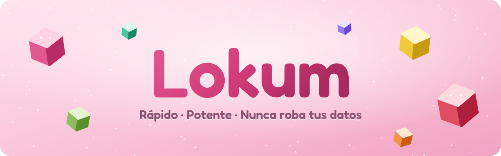

<p align="center">
  
</p>

<p align="center">
  <a href="../../README.md">English</a> ·
  <a href="README.tr.md">Türkçe</a> ·
  <a href="README.de.md">Deutsch</a> ·
  <a href="README.fr.md">Français</a> ·
  <a href="README.it.md">Italiano</a> ·
  <a href="README.rm.md">Rumantsch</a> ·
  <b>Español</b> ·
  <a href="README.sv.md">Svenska</a> ·
  <a href="README.ko.md">한국어</a> ·
  <a href="README.ja.md">日本語</a> ·
  <a href="README.zh-CN.md">简体中文</a> ·
  <a href="README.zh-TW.md">繁體中文</a>
</p>

<p align="center">
  <a href="https://github.com/SametEge/Lokum/releases/latest"></a>
  <a href="https://github.com/SametEge/Lokum/releases"></a>
  
  
  <a href="../../LICENSE"></a>
</p>

**Lokum** es un navegador web construido sobre Mozilla Firefox y con sabor a
lokum, la delicia turca. Toma el motor, la seguridad y las extensiones en los
que ya confías y los envuelve en una barra lateral al estilo de Arc, doce
«sabores» de color mezclados a mano, Espacios, una paleta de comandos,
animaciones suaves y una primera configuración inusualmente cuidada — en doce
idiomas. Se actualiza solo, en silencio, desde GitHub Releases en cuanto hay una
versión nueva.

<p align="center">
  
  
</p>

---

## Contenido

<!-- toc -->
- [Descarga](#descarga)
- [Lo más destacado](#lo-más-destacado)
- [Sabores](#sabores)
- [Diseños: barra lateral o pestañas clásicas](#diseños-barra-lateral-o-pestañas-clásicas)
- [Espacios](#espacios)
- [Paleta y barra de comandos](#paleta-y-barra-de-comandos)
- [Pestañas que se ordenan solas](#pestañas-que-se-ordenan-solas)
- [El recorrido de bienvenida](#el-recorrido-de-bienvenida)
- [Ajustes](#ajustes)
- [Privacidad](#privacidad)
- [Idiomas](#idiomas)
- [Actualizaciones automáticas](#actualizaciones-automáticas)
- [Atajos de teclado](#atajos-de-teclado)
- [Instalación](#instalación)
- [Compilar desde el código fuente](#compilar-desde-el-código-fuente)
- [Cómo funciona Lokum](#cómo-funciona-lokum)
- [Versiones e integración continua](#versiones-e-integración-continua)
- [Preguntas frecuentes](#preguntas-frecuentes)
- [Contribuir](#contribuir)
- [Licencia y marcas](#licencia-y-marcas)
<!-- /toc -->

---

## Descarga

Consigue la versión más reciente en la **[página de versiones](https://github.com/SametEge/Lokum/releases/latest)**.

| Archivo | Para | Notas |
| --- | --- | --- |
| `Lokum-Setup-<versión>-x64.exe` | Windows 10 / 11 (64 bits) | **Recomendado.** Se instala solo para tu usuario, sin permisos de administrador, y se actualiza solo. |
| `Lokum-<versión>-win64.zip` | Windows, portátil | Descomprímelo donde quieras (incluso en un USB) y ejecuta `lokum.exe`. Te avisa de las actualizaciones. |
| `Lokum-<versión>-linux-x86_64.tar.xz` | Linux (64 bits) | Extrae y ejecuta `./lokum`; `install-desktop-entry.sh` lo añade al menú de aplicaciones. |
| `latest.json`, `SHA256SUMS.txt` | Todos | Manifiesto que usa el actualizador integrado y sumas SHA‑256 de cada archivo. |

> **Windows SmartScreen.** Lokum todavía no está firmado digitalmente (los
> certificados son caros para un proyecto personal), así que la primera vez
> Windows puede decir *«Windows protegió tu PC»*. Haz clic en **Más
> información → Ejecutar de todas formas**. Siempre puedes comparar el archivo
> con `SHA256SUMS.txt` en la página de la versión.

---

## Lo más destacado

- 🍬 **Doce sabores** — cada tema es un tipo de lokum: Rosa, Pistacho, Limón, Granada, Naranja, Menta, Lavanda, Almáciga, Coco, Café turco, Medianoche y una caja *Surtido* animada. Cada uno con receta clara y oscura.
- 🧭 **Barra lateral estilo Arc _o_ pestañas clásicas** — una barra lateral de altura completa con la barra de direcciones dentro, las pestañas verticales de Firefox o la tira de pestañas clásica. Cambia cuando quieras; la ventana se reorganiza en vivo.
- 🗂️ **Espacios** — separa Personal, Trabajo, Estudios y Ocio, cada uno con sus pestañas, su icono, su sabor y (opcionalmente) su contenedor. Desliza o pulsa <kbd>Ctrl</kbd>+<kbd>Alt</kbd>+<kbd>←</kbd>/<kbd>→</kbd> para cambiar.
- ⌨️ **Paleta de comandos** (<kbd>Ctrl</kbd>+<kbd>K</kbd>) — búsqueda aproximada entre pestañas abiertas y más de 40 acciones, y una gran **barra de comandos flotante** al hacer clic en la barra de direcciones.
- 🎵 **Minirreproductor** — reproduce, pausa, salta y silencia la música o los vídeos de otras pestañas desde la barra lateral.
- 🧹 **Pestañas que se ordenan solas** — archiva automáticamente las pestañas sin usar, duerme las pestañas en segundo plano y reabre cualquier cosa desde el Archivo.
- 🌟 **Un recorrido de bienvenida como ninguno** — elige tu sabor dejando caer cubos 3D de lokum espolvoreados de azúcar, mira cómo el navegador se reorganiza detrás del asistente, crea Espacios a partir de plantillas, importa tu antiguo navegador y elige tu nivel de privacidad. Confeti incluido.
- ⚙️ **Unos ajustes que da gusto usar** — doce secciones, búsqueda instantánea, vistas previas en vivo, exportar/importar tus ajustes de Lokum.
- 🔒 **Privado por defecto** — sin telemetría, sin estudios, sin contenido patrocinado; protección estricta contra el rastreo a un clic; uBlock Origin, DNS seguro, modo solo HTTPS, GPC y protección contra huellas digitales en los ajustes.
- 🌍 **Doce idiomas** — inglés, turco, alemán, francés, italiano, romanche, español, sueco, coreano, japonés, chino simplificado y tradicional, tanto para Lokum como para el propio Firefox.
- 🔄 **Actualizaciones automáticas** — GitHub Actions compila nuevas versiones con cada cambio y cada vez que Mozilla publica un nuevo Firefox, y se instalan en silencio al cerrar Lokum.
- 🦊 **Firefox de verdad por dentro** — compilaciones oficiales de Mozilla, el motor Gecko, todos los complementos de Firefox, Firefox Sync y las correcciones de seguridad de Mozilla en cuanto salen.

---

## Sabores

Un sabor colorea todo el navegador: el marco de la ventana, la barra lateral, el
color de acento de botones e interruptores, la página de nueva pestaña y las
páginas propias de Lokum. Cada sabor tiene una receta clara y otra oscura, y
puedes sustituir el acento por el color que quieras. Los Espacios pueden tener
su propio sabor, de modo que la ventana cambia de color al cambiar de Espacio.

| | Sabor | Estilo |
| --- | --- | --- |
| 🌹 | **Rosa** | El clásico lokum de agua de rosas, rosa suave. *(predeterminado)* |
| 🌰 | **Pistacho** | Verde pistacho fresco, sereno y concentrado. |
| 🍋 | **Limón** | Ralladura de limón soleada para mañanas luminosas. |
| 🍎 | **Granada** | Rojo granada intenso, atrevido y jugoso. |
| 🍊 | **Naranja** | El cálido brillo de la naranja y la bergamota. |
| 🌿 | **Menta** | Menta fresca, viva como una brisa de primavera. |
| 💜 | **Lavanda** | Lavanda suave para tardes de ensueño. |
| 🤍 | **Almáciga** | Marfil cremoso de almáciga, sereno y elegante. |
| 🥥 | **Coco** | Blanco coco, limpio y minimalista. |
| ☕ | **Café turco** | Los intensos marrones del café turco. |
| 🌙 | **Medianoche** | Ciruela de medianoche estrellada para los noctámbulos. |
| 🎨 | **Surtido** | Una caja de lokums surtidos que recorre lentamente todos los colores. |

Las pruebas comprueban cada paleta: el texto debe alcanzar un contraste WCAG de
4,5:1 sobre su marco y los botones de acento 3:1, tanto en modo claro como
oscuro.

Toques extra que puedes activar o desactivar: **azúcar glas** (pequeños
destellos que brillan en la barra lateral), **grano suave** (una sutil textura
de papel), esquinas redondeadas de la página, espaciado del marco, sombra de la
página, densidad de la interfaz (compacta / normal / cómoda), fuente de la
interfaz (sistema / redondeada / serif) y tres niveles de animación (completas,
reducidas — los colores se funden pero nada se mueve — o desactivadas). Lokum
también respeta el ajuste del sistema *reducir movimiento*.

<p align="center">
  
</p>

---

## Diseños: barra lateral o pestañas clásicas

| Diseño | Cómo se ve |
| --- | --- |
| **Barra lateral (estilo Arc)** *(predeterminado)* | Pestañas, barra de direcciones y botones de navegación viven en una única barra lateral de altura completa. La página flota sobre tu sabor como una tarjeta redondeada, con una fina franja de título encima que muestra el título, el sitio y un botón *Copiar enlace*. |
| **Pestañas verticales** | Las pestañas verticales nativas de Firefox en una barra lateral, con la barra de direcciones arriba. Familiar y espacioso. |
| **Pestañas clásicas** | Pestañas arriba, como en cualquier navegador — siempre vestidas con tu sabor. |

<p align="center">
  
</p>

Más opciones de diseño:

- **Lado de la barra lateral** — izquierda o derecha.
- **Ocultar la barra lateral (modo compacto)** — <kbd>Ctrl</kbd>+<kbd>Alt</kbd>+<kbd>S</kbd>. La página ocupa toda la ventana y la barra lateral aparece cuando el puntero toca el borde.
- **Barra de comandos flotante** — la barra de direcciones se abre grande y centrada sobre la página, como en Arc.
- **Las pestañas nuevas aparecen** arriba o abajo de la lista.
- **Botón de cerrar pestaña** al pasar el ratón, siempre o nunca.
- **Las pestañas fijadas se convierten en favoritas** — una cuadrícula de iconos grandes arriba en la barra lateral, igual en todos los Espacios.
- **Barra de marcadores**, **minirreproductor** y **personalización de la barra de herramientas**.

---

## Espacios

Los Espacios mantienen separadas las distintas partes de tu vida. Cada Espacio
tiene su propia lista de pestañas, un nombre, un icono emoji, un sabor opcional
que recolorea la ventana mientras estás en él y un **contenedor** de Firefox
opcional; así, por ejemplo, tu Espacio de Trabajo sigue conectado a tus cuentas
del trabajo.

- Cambia con los iconos de la parte inferior de la barra lateral, **deslizando hacia los lados** sobre la barra lateral (o <kbd>Mayús</kbd> + rueda del ratón), con <kbd>Ctrl</kbd>+<kbd>Alt</kbd>+<kbd>←</kbd>/<kbd>→</kbd>, o salta directamente a uno con <kbd>Ctrl</kbd>+<kbd>Alt</kbd>+<kbd>1</kbd>…<kbd>9</kbd>.
- **Arrastra una pestaña sobre el icono de un Espacio** para moverla, o usa *Mover al espacio* en el menú contextual de la pestaña.
- Haz clic derecho en el nombre del Espacio para renombrarlo, cambiar su icono, sabor o contenedor, vaciar sus pestañas, o crear y eliminar Espacios.
- Gestiónalo todo — incluido el orden — en **Ajustes → Espacios**.
- Los Espacios se guardan en tu perfil (`lokum/spaces.json`) y cada pestaña recuerda su Espacio aunque reinicies.

<p align="center">
  
</p>

---

## Paleta y barra de comandos

Pulsa <kbd>Ctrl</kbd>+<kbd>K</kbd> en cualquier momento. Escribe unas letras y
Lokum encuentra pestañas abiertas y acciones con búsqueda aproximada: nueva
pestaña/ventana/ventana privada, reabrir la pestaña cerrada, duplicar, fijar,
copiar enlace, **vista dividida** con la última pestaña, vista de lectura,
imagen en imagen, captura de pantalla, buscar, imprimir, zoom, descargas,
historial, marcadores, extensiones, herramientas para desarrolladores, limpiar
el historial reciente, modo oscuro, cada diseño, cada sabor, cada Espacio y los
ajustes de Lokum o de Firefox. Todo lo demás se convierte en una búsqueda web.

<p align="center">
  
  
</p>

Al hacer clic en la barra de direcciones (o pulsar <kbd>Ctrl</kbd>+<kbd>L</kbd>)
en el diseño con barra lateral, se convierte en una gran **barra de comandos
flotante** en el centro de la ventana — con todas las sugerencias, atajos de
búsqueda e historial de Firefox, y espacio para respirar.

---

## Pestañas que se ordenan solas

- **Archivado automático** — las pestañas no fijadas que no abres desde hace 12 horas, un día, una semana o un mes se cierran y se guardan en el **Archivo** (hasta 600 pestañas). Busca y reabre lo que quieras en **Ajustes → Archivo** o desde el botón de biblioteca de la barra lateral.
- **Pestañas dormidas** — las pestañas en segundo plano pueden descargarse tras unos minutos para ahorrar memoria y batería; vuelven al hacer clic en ellas.
- **Minirreproductor** — cuando una pestaña reproduce contenido, una pequeña tarjeta en la barra lateral muestra la carátula, el título y el artista con anterior / reproducir‑pausa / siguiente y silencio.
- Y todo lo que trae Firefox: **grupos de pestañas**, **vista dividida**, vistas previas de pestañas, **imagen en imagen** automática y restauración de sesión.

---

## El recorrido de bienvenida

La primera vez que abres Lokum aparece un recorrido de bienvenida a pantalla
completa sobre el navegador — y el navegador cambia en vivo detrás de él a
medida que eliges.

<p align="center">
  
  
</p>

1. **Bienvenida** — un cubo de lokum 3D flotante, azúcar que revolotea y un selector de idioma.
2. **Sabor** — doce cubos azucarados caen en una bandeja; toca uno y todo el navegador cambia de color con una nube de azúcar glas. Elige claro, oscuro o automático, o pulsa **Sorpréndeme** para una ruleta de sabores.
3. **Diseño** — barra lateral estilo Arc, pestañas verticales o clásicas, lado de la barra y modo compacto, con vista previa en vivo.
4. **Espacios** — empieza con Personal y añade Trabajo, Estudios y Ocio con un toque cada uno.
5. **Importar** — Lokum detecta los otros navegadores de tu ordenador (Chrome, Edge, Brave, Opera, Vivaldi…) y trae marcadores, contraseñas, historial y más.
6. **Privacidad** — protección contra el rastreo Equilibrada o Estricta, uBlock Origin, DNS seguro; la telemetría siempre está desactivada.
7. **Listo** — un resumen de tus elecciones, *hacer de Lokum mi navegador predeterminado* y confeti.

Puedes repetirlo cuando quieras desde **Ajustes → Avanzado → Recorrido de
bienvenida**.

---

## Ajustes

Abre los **Ajustes de Lokum** con <kbd>Ctrl</kbd>+<kbd>,</kbd>, desde el menú
principal, desde la barra lateral o escribiendo `about:lokum`. Cada opción se
aplica al instante y el cuadro de búsqueda encuentra cualquier ajuste por su
nombre.

| Sección | Qué puedes hacer |
| --- | --- |
| **Apariencia** | Galería de sabores, claro/oscuro/automático, color de acento propio, azúcar glas, grano, animaciones, redondez de las esquinas, espaciado del marco, sombra de la página, densidad, fuente de la interfaz. |
| **Diseño** | Barra lateral Arc / vertical / clásica, lado de la barra, modo compacto, barra de comandos flotante, posición de las pestañas nuevas, botones de cerrar, minirreproductor, barra de marcadores, personalizar la barra de herramientas. |
| **Espacios** | Activar Espacios, colorear la ventana según el Espacio, deslizar para cambiar; añadir, renombrar, cambiar icono y sabor, reordenar y eliminar Espacios; elegir contenedores. |
| **Pestañas** | Archivado automático, pestañas dormidas, restaurar al iniciar, vistas previas, grupos de pestañas, vista dividida, imagen en imagen automática, confirmar antes de salir. |
| **Archivo** | Buscar, reabrir y quitar pestañas archivadas; vaciar el archivo. |
| **Privacidad y seguridad** | Protección contra el rastreo Equilibrada/Estricta, uBlock Origin con un clic, modo solo HTTPS, DNS seguro (Cloudflare, Quad9, Mullvad, NextDNS, AdGuard…), Global Privacy Control, protección contra huellas digitales, borrar el historial al cerrar, bloqueo de ventanas emergentes. |
| **Búsqueda** | Buscador predeterminado, sugerencias, búsquedas populares, gestionar buscadores. |
| **Atajos** | Todos los atajos de Lokum, con un interruptor para desactivarlos si chocan con algún sitio. |
| **Idioma** | Idioma de la interfaz (doce incluidos), corrector ortográfico, idiomas preferidos para sitios web. |
| **Actualizaciones** | Versión actual, buscar ahora, búsqueda e instalación automáticas, canal estable/beta, intervalo, notas de la versión, todas las versiones. |
| **Avanzado** | Navegador predeterminado, importar desde otro navegador, recorrido de bienvenida, exportar/importar ajustes de Lokum (JSON), carpeta del perfil, restablecer los ajustes de Lokum, desplazamiento suave, `userChrome.css` propio, todos los ajustes de Firefox, `about:config`. |
| **Acerca de Lokum** | Versión, motor Firefox, fecha de compilación, plataforma, perfil; enlaces para informar de un problema, notas de la versión y licencias. |

<p align="center">
  
</p>

Todo lo que ofrece Firefox sigue a un clic en los **ajustes de Firefox**
(`about:preferences`).

---

## Privacidad

Lokum empieza siendo privado y así sigue:

- **Sin telemetría, sin estudios, sin informes de fallos, sin agente de navegador predeterminado.** Se desactivan mediante directivas empresariales (`distribution/policies.json`) y se eliminan del paquete.
- **Sin contenido patrocinado** — ni accesos directos ni historias patrocinadas en la página de nueva pestaña, sin Pocket, sin extensiones ni funciones «recomendadas».
- **Protección mejorada contra el rastreo** en modo *Equilibrado* por defecto, *Estricto* a un clic.
- **uBlock Origin** se instala con un clic desde el recorrido de bienvenida o los ajustes.
- Ajustes predefinidos de **DNS seguro**, modo **solo HTTPS**, **Global Privacy Control**, **protección contra huellas digitales** y **borrar al cerrar** en la sección de Privacidad.

A qué se conecta Lokum por sí mismo: `github.com` / `api.github.com` para buscar
actualizaciones (puedes desactivarlo en **Ajustes → Actualizaciones**). Todo lo
demás es el comportamiento normal de Firefox — por ejemplo las listas de
Navegación segura, los datos de revocación de certificados y la tienda de
complementos —, que puedes gestionar en los ajustes de privacidad de Firefox.

---

## Idiomas

Lokum incluye doce idiomas y, al abrirlo por primera vez, usa el elegido en el
instalador o el idioma de tu sistema operativo. Cámbialo cuando quieras en
**Ajustes → Idioma** (un reinicio completa el cambio en todas partes).

| Idioma | Código | | Idioma | Código |
| --- | --- | --- | --- | --- |
| Inglés (English) | `en` | | Español | `es-ES` |
| Turco (Türkçe) | `tr` | | Sueco (Svenska) | `sv-SE` |
| Alemán (Deutsch) | `de` | | Coreano (한국어) | `ko` |
| Francés (Français) | `fr` | | Japonés (日本語) | `ja` |
| Italiano | `it` | | Chino simplificado (简体中文) | `zh-CN` |
| Romanche (Rumantsch) | `rm` | | Chino tradicional (繁體中文) | `zh-TW` |

La interfaz de Firefox procede de los paquetes de idioma oficiales de Mozilla,
que la compilación integra en la aplicación; los añadidos de Lokum (barra
lateral, ajustes, recorrido de bienvenida, actualizador…) usan pequeños
diccionarios JSON en `src/lokum/locales/`. Una prueba comprueba que cada
diccionario esté completo y conserve los mismos `{marcadores}` que el inglés. El
instalador de Windows está disponible en todos estos idiomas excepto el
romanche.

---

## Actualizaciones automáticas

1. Cada seis horas (configurable), Lokum descarga el pequeño archivo `latest.json` de la última versión en GitHub.
2. Si hay una versión más nueva, aparece una tarjeta en la barra lateral y el instalador se descarga en segundo plano — solo desde los servidores de descarga de versiones de GitHub.
3. El **SHA‑256** del archivo se compara con `latest.json`; lo que no coincida se descarta.
4. Al cerrar Lokum, la actualización se instala en silencio en segundo plano. La próxima vez que lo abras estarás en la versión nueva y un aviso *«Lokum se actualizó»* te lleva a las notas de la versión. **Reiniciar y actualizar** instala al momento y vuelve a abrir Lokum.

Elige el canal **Estable** o **Beta**, el intervalo de comprobación, o desactiva
la instalación automática en **Ajustes → Actualizaciones**. La edición zip
portátil solo te avisa. El actualizador de Firefox de Mozilla está
desactivado — las versiones de Lokum te traen el nuevo Firefox.

---

## Atajos de teclado

| Atajo | Acción |
| --- | --- |
| <kbd>Ctrl</kbd>+<kbd>K</kbd> | Paleta de comandos |
| <kbd>Ctrl</kbd>+<kbd>Alt</kbd>+<kbd>S</kbd> | Mostrar / ocultar la barra lateral (modo compacto) |
| <kbd>Ctrl</kbd>+<kbd>Alt</kbd>+<kbd>→</kbd> / <kbd>←</kbd> | Espacio siguiente / anterior |
| <kbd>Ctrl</kbd>+<kbd>Alt</kbd>+<kbd>1</kbd> … <kbd>9</kbd> | Ir al Espacio 1–9 |
| <kbd>Ctrl</kbd>+<kbd>Mayús</kbd>+<kbd>C</kbd> | Copiar el enlace de la página |
| <kbd>Ctrl</kbd>+<kbd>,</kbd> | Ajustes de Lokum |
| <kbd>Ctrl</kbd>+<kbd>T</kbd> | Nueva pestaña |
| <kbd>Ctrl</kbd>+<kbd>L</kbd> | Barra de direcciones (barra de comandos flotante) |
| <kbd>Ctrl</kbd>+<kbd>Mayús</kbd>+<kbd>T</kbd> | Reabrir la pestaña cerrada |

Todos los demás atajos de Firefox funcionan como siempre. Los atajos propios de
Lokum se pueden desactivar en **Ajustes → Atajos**.

---

## Instalación

### Windows (instalador)

1. Descarga `Lokum-Setup-<versión>-x64.exe` de la [última versión](https://github.com/SametEge/Lokum/releases/latest).
2. Ejecútalo (mira la nota sobre SmartScreen más arriba), elige tu idioma, si quieres un acceso directo en el escritorio y si Lokum será tu navegador predeterminado, y haz clic en **Instalar**.
3. Lokum se instala en `%LOCALAPPDATA%\Programs\Lokum` — por usuario, sin permisos de administrador — y se registra como navegador, así que puedes elegirlo en **Configuración de Windows → Aplicaciones predeterminadas**.

Opciones de línea de comandos para instalaciones automatizadas:

| Opción | Significado |
| --- | --- |
| `/S` | Instalación silenciosa |
| `/D=C:\ruta\Lokum` | Carpeta de instalación (debe ir al final) |
| `/DESKTOP=0` | Sin acceso directo en el escritorio (predeterminado `1`) |
| `/UBLOCK=0` | No instalar uBlock Origin (predeterminado `1`: se instala en el primer inicio) |
| `/UPDATE` | Actualizar una instalación existente (lo usa el actualizador) |
| `/RELAUNCH` | Abrir Lokum al terminar |

Para desinstalar usa **Configuración de Windows → Aplicaciones → Lokum**. El
desinstalador pregunta si quieres conservar tu perfil (marcadores, contraseñas,
historial) o eliminarlo también.

### Windows (portátil)

Descomprime `Lokum-<versión>-win64.zip` donde quieras y ejecuta `lokum.exe`. La
edición portátil no toca el registro y solo te avisa de las actualizaciones.

### Linux

```sh
tar -xJf Lokum-<versión>-linux-x86_64.tar.xz
cd lokum
./lokum                      # ejecutar
./install-desktop-entry.sh   # opcional: añadir Lokum al menú de aplicaciones
```

### Dónde están tus datos

Lokum usa su propio perfil, separado de cualquier Firefox instalado.
**Ajustes → Avanzado → Carpeta del perfil** lo abre. Los datos propios de Lokum
(Espacios, archivo de pestañas) están en la carpeta `lokum` dentro del perfil.

---

## Compilar desde el código fuente

Lokum no compila Firefox. La compilación descarga una **versión oficial de
Firefox** de `archive.mozilla.org`, la verifica con los `SHA512SUMS` de Mozilla
y la convierte en Lokum. Una compilación completa para Windows tarda unos
minutos en un equipo normal, y los paquetes de Windows se pueden generar en
Linux.

**Requisitos**

- Python 3.10+
- Node.js 20+ (reescribe los iconos y la información de versión de `lokum.exe` con [resedit](https://github.com/jet2jet/resedit-js))
- `7z` (p7zip) para extraer el instalador de Firefox para Windows, `tar` y `xz`
- NSIS 3 (`makensis`) para el instalador de Windows

En Ubuntu/Debian: `sudo apt install python3 nodejs npm p7zip-full nsis xz-utils`

**Compilar**

```sh
git clone https://github.com/SametEge/Lokum.git
cd Lokum
npm ci --prefix scripts/pe          # una vez, para compilaciones de Windows

# Instalador de Windows + zip portátil a partir del último Firefox
python3 scripts/build.py --platform win64

# Archivo de Linux sobre una versión concreta de Firefox
python3 scripts/build.py --platform linux-x86_64 --firefox-version 156.0
```

Los resultados quedan en `dist/`. Opciones útiles:

| Opción | Significado |
| --- | --- |
| `--platform {win64,win-arm64,linux-x86_64}` | Plataforma de destino |
| `--firefox-version X` | Versión de Firefox base (por defecto: la fijada en `firefox.json` o, si no, la más reciente) |
| `--version X` | Versión de Lokum (por defecto: `version.json` + `-dev`) |
| `--firefox-dir CARPETA` | Usar un Firefox ya extraído en lugar de descargarlo |
| `--no-locales` | Omitir los paquetes de idioma (más rápido) |
| `--no-installer` | Omitir NSIS |
| `--app-only` | Parar tras preparar la carpeta de la aplicación |

**Desarrollar con un Firefox extraído**

```sh
scripts/dev/install.sh /ruta/a/firefox        # copia dentro la capa de Lokum
/ruta/a/firefox/firefox --profile /tmp/lokum-dev --no-remote
```

La mayoría de los cambios en `src/lokum` solo necesitan reiniciar el navegador.

**Pruebas**

```sh
node --test "tests/unit/*.test.mjs"      # lógica principal, contraste de los sabores
python3 tests/check_locales.py --strict  # diccionarios completos
node scripts/dev/make_content_css.mjs --check
LOKUM_SELFTEST=out.json ./lokum --headless   # 25 comprobaciones en el navegador
```

`LOKUM_SELFTEST` hace que un Lokum real ejecute una autoprueba (diseño,
Espacios, sabores, paleta de comandos, páginas de ajustes y bienvenida, idiomas,
marca, actualizador y directivas), escriba el resultado en JSON y se cierre. La
CI la ejecuta en Windows y Linux tras instalar los paquetes recién compilados.

---

## Cómo funciona Lokum

```
versión oficial de Firefox ──► verificar SHA512 ──► extraer
        │
        ├─ integrar 11 paquetes de idioma de Mozilla en omni.ja (+ lista multilingüe)
        ├─ sustituir la marca Firefox (nombres, logotipos, iconos) por la de Lokum
        ├─ añadir la capa de Lokum:  defaults/pref/lokum-autoconfig.js
        │                            lokum.cfg  (arranque autoconfig)
        │                            distribution/policies.json
        │                            browser/lokum/  (paquete chrome://lokum)
        ├─ quitar el actualizador, el informe de fallos y la telemetría
        ├─ firefox.exe → lokum.exe, iconos e información de versión nuevos
        └─ empaquetar: instalador NSIS · zip portátil · archivo de Linux
```

Al arrancar, Firefox lee `lokum-autoconfig.js`, que carga `lokum.cfg`. Ese
pequeño arranque registra el paquete `chrome://lokum/` e inicia
`LokumStartup.sys.mjs`, que conecta todo lo demás:

| Módulo | Función |
| --- | --- |
| `LokumStartup` | Arranque/cierre, recorrido de bienvenida, aviso «actualizado», autoprueba |
| `LokumWindow` | Controlador por ventana: hojas de estilo, atributos raíz, franja de título, modo compacto, barra de comandos flotante, atajos |
| `LokumFlavors` | Las doce paletas como variables CSS `light-dark()` |
| `LokumLayout` | Traduce el diseño de Lokum a las preferencias de Firefox (barra lateral, pestañas verticales) y a la colocación de las barras de herramientas |
| `LokumSpaces` | Espacios: guardado, cambio, cabecera y pie de la barra lateral, menús, arrastrar y soltar |
| `LokumTabs` | Archivado automático y pestañas dormidas |
| `LokumCommandPalette` | Paleta <kbd>Ctrl</kbd>+<kbd>K</kbd> |
| `LokumMediaCard` | Minirreproductor de la barra lateral |
| `LokumUpdater` | Búsqueda de actualizaciones, descargas verificadas, instalación silenciosa al cerrar |
| `LokumI18n` | Diccionarios de Lokum y elección del idioma en el primer arranque |
| `LokumShell` | Integración con Windows como navegador predeterminado |
| `LokumContentStyles` | Viste la página de nueva pestaña y los ajustes de Firefox con el sabor activo |
| `LokumAboutPages` | `about:lokum` (ajustes) y `about:lokum-welcome` (recorrido) |
| `LokumSelfTest` | Autoprueba en el navegador que usa la CI |

Estructura del repositorio:

```
src/app/            archivos copiados junto al ejecutable de Firefox (autoconfig, directivas)
src/lokum/          el paquete chrome://lokum
  modules/          módulos JavaScript (arriba)
  styles/           estilos de la interfaz (tokens, marco, diseño, componentes, animaciones)
  pages/            ajustes about:lokum y recorrido de bienvenida
  locales/          diccionarios de Lokum (12 idiomas)
  images/           iconos y logotipos
scripts/build.py    la compilación (ver scripts/lokumbuild/)
scripts/release.py  planificación de versiones, latest.json, notas de la versión
scripts/pe/         recursos del ejecutable de Windows (resedit)
installer/          instalador NSIS y sus traducciones
branding/           fuentes del logotipo e iconos generados
tests/              pruebas unitarias, comprobación de idiomas, pruebas de humo
.github/workflows/  CI, compilaciones y publicaciones automáticas
```

---

## Versiones e integración continua

- **Cada pull request y cada push a una rama** ejecuta las pruebas unitarias y de idiomas, compila los paquetes de Windows y Linux, los instala en máquinas Windows y Linux reales y ejecuta la autoprueba en el navegador.
- **Cada push a `main`** hace lo mismo y después publica una **nueva versión en GitHub** con el instalador, el zip portátil, el archivo de Linux, `latest.json`, `SHA256SUMS.txt` y notas de la versión generadas. Las copias instaladas se actualizan desde ahí.
- **Cada seis horas**, una tarea programada pregunta a Mozilla por la última versión de Firefox; si es más nueva que la de la última publicación, Lokum se recompila sobre ella y se publica automáticamente — así las correcciones de seguridad te llegan sin que nadie mueva un dedo.
- Las publicaciones también pueden lanzarse a mano (**Actions → Release → Run workflow**), opcionalmente sobre una versión de Firefox concreta o como versión preliminar beta.

Los números de versión salen de `version.json`; cada publicación incrementa
automáticamente el número de parche. Si lo necesitas, fija una versión de
Firefox con un archivo `firefox.json` (`{"version": "156.0"}`).

---

## Preguntas frecuentes

**¿Es Lokum un fork de Firefox?**
No en el sentido de un motor aparte. Lokum reempaqueta las compilaciones
oficiales de Firefox de Mozilla y añade su propia capa de interfaz, así que
obtienes exactamente el motor, el rendimiento, la compatibilidad web y las
correcciones de seguridad de Firefox.

**¿Funcionan las extensiones de Firefox?**
Sí — funcionan todos los complementos de [addons.mozilla.org](https://addons.mozilla.org).

**¿Puedo usar Firefox Sync?**
Sí. Inicia sesión en **Ajustes de Firefox → Sync** para sincronizar marcadores,
contraseñas, historial, pestañas y complementos con Firefox en tus otros
dispositivos.

**¿Lokum modifica o lee mi Firefox actual?**
No. Lokum tiene su propio perfil. Usa el paso de importación (o **Ajustes →
Avanzado → Importar**) si quieres traer tus datos.

**¿Por qué me avisa el antivirus / SmartScreen?**
El instalador aún no está firmado digitalmente. Compara el archivo con
`SHA256SUMS.txt` en la página de la versión o compila Lokum tú mismo.

**¿Hay versión para macOS?**
Todavía no. Windows y Linux se compilan y prueban con cada cambio.

**Algo se ve mal tras una actualización. ¿Cómo lo restablezco?**
**Ajustes → Avanzado → Restablecer los ajustes de Lokum** restaura todas las
opciones de Lokum pero conserva tus pestañas, Espacios y datos.

---

## Contribuir

Los informes de errores, ideas, traducciones y pull requests son muy
bienvenidos.

- Informa de errores e ideas en [Issues](https://github.com/SametEge/Lokum/issues).
- Para mejorar una traducción, edita `src/lokum/locales/<código>.json` (e `installer/strings.nsh` para el instalador) y ejecuta `python3 tests/check_locales.py --strict`.
- Para añadir un sabor, añade una paleta en `src/lokum/modules/LokumFlavors.sys.mjs`, su nombre y descripción en cada diccionario, y ejecuta `node scripts/dev/make_content_css.mjs` y las pruebas unitarias (comprueban el contraste).
- Ejecuta las pruebas de arriba antes de abrir un pull request.

---

## Licencia y marcas

El código fuente de Lokum se distribuye bajo la
[Mozilla Public License 2.0](../../LICENSE), la misma licencia que Firefox.

Firefox y el logotipo de Firefox son marcas de la Mozilla Foundation. Lokum es
un proyecto independiente, no afiliado ni respaldado por Mozilla; se construye a
partir de las versiones oficiales de Mozilla y elimina de ellas la marca
Firefox. Arc es una marca de The Browser Company, que tampoco está afiliada a
Lokum — Lokum simplemente se inspira en sus ideas. uBlock Origin es obra de
Raymond Hill y sus colaboradores.

<p align="center"><sub>Hecho con 🍬 y Firefox.</sub></p>
