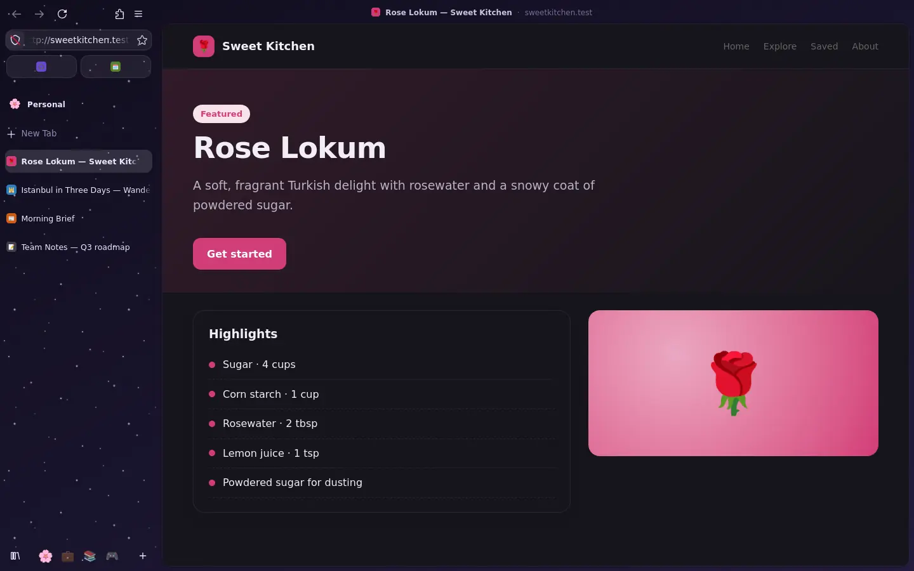
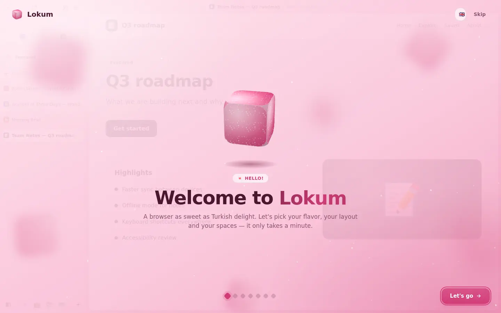

<p align="center">
  
</p>

<p align="center">
  <a href="../../README.md">English</a> ·
  <a href="README.tr.md">Türkçe</a> ·
  <a href="README.de.md">Deutsch</a> ·
  <b>Français</b> ·
  <a href="README.it.md">Italiano</a> ·
  <a href="README.rm.md">Rumantsch</a> ·
  <a href="README.es.md">Español</a> ·
  <a href="README.sv.md">Svenska</a> ·
  <a href="README.ko.md">한국어</a> ·
  <a href="README.ja.md">日本語</a> ·
  <a href="README.zh-CN.md">简体中文</a> ·
  <a href="README.zh-TW.md">繁體中文</a>
</p>

<p align="center">
  <a href="https://github.com/SametEge/Lokum/releases/latest"></a>
  <a href="https://github.com/SametEge/Lokum/releases"></a>
  
  
  <a href="../../LICENSE"></a>
</p>

**Lokum** est un navigateur Web construit sur Mozilla Firefox et parfumé comme
un loukoum. Il reprend le moteur, la sécurité et les extensions auxquels vous
faites déjà confiance et les enveloppe dans une barre latérale pleine hauteur, douze
« saveurs » de couleurs mélangées à la main, des Espaces, une palette de
commandes, des animations délicates et une première configuration d'une rare
minutie — en douze langues. Il se met à jour tout seul, discrètement, via
GitHub Releases dès qu'une nouvelle version est prête.

<p align="center">
  
  
</p>

---

## Sommaire

<!-- toc -->
- [Téléchargement](#téléchargement)
- [Points forts](#points-forts)
- [Saveurs](#saveurs)
- [Dispositions : barre latérale ou onglets classiques](#dispositions--barre-latérale-ou-onglets-classiques)
- [Espaces](#espaces)
- [Palette et barre de commandes](#palette-et-barre-de-commandes)
- [Des onglets qui se rangent tout seuls](#des-onglets-qui-se-rangent-tout-seuls)
- [La visite de bienvenue](#la-visite-de-bienvenue)
- [Paramètres](#paramètres)
- [Vie privée](#vie-privée)
- [Langues](#langues)
- [Mises à jour automatiques](#mises-à-jour-automatiques)
- [Raccourcis clavier](#raccourcis-clavier)
- [Installation](#installation)
- [Compiler depuis les sources](#compiler-depuis-les-sources)
- [Comment fonctionne Lokum](#comment-fonctionne-lokum)
- [Versions et intégration continue](#versions-et-intégration-continue)
- [FAQ](#faq)
- [Contribuer](#contribuer)
- [Licence et marques](#licence-et-marques)
<!-- /toc -->

---

## Téléchargement

Récupérez la dernière version sur la **[page des versions](https://github.com/SametEge/Lokum/releases/latest)**.

| Fichier | Pour | Remarques |
| --- | --- | --- |
| `Lokum-Setup-<version>-x64.exe` | Windows 10 / 11 (64 bits) | **Recommandé.** S'installe pour votre utilisateur uniquement, sans droits d'administrateur, se met à jour tout seul. |
| `Lokum-<version>-win64.zip` | Windows, portable | Décompressez n'importe où (même sur une clé USB) et lancez `lokum.exe`. Vous signale les mises à jour. |
| `Lokum-<version>-linux-x86_64.tar.xz` | Linux (64 bits) | Décompressez et lancez `./lokum` ; `install-desktop-entry.sh` l'ajoute à votre menu d'applications. |
| `latest.json`, `SHA256SUMS.txt` | Tout le monde | Manifeste utilisé par le programme de mise à jour intégré et sommes SHA‑256 de chaque fichier. |

> **Windows SmartScreen.** Lokum n'est pas encore signé (les certificats sont
> chers pour un projet de passionné) ; Windows peut donc afficher *« Windows a
> protégé votre ordinateur »* au premier lancement. Cliquez sur **Informations
> complémentaires → Exécuter quand même**. Vous pouvez toujours comparer le
> fichier avec `SHA256SUMS.txt` sur la page de la version.

---

## Points forts

- 🍬 **Douze saveurs** — chaque thème est une sorte de loukoum : Rose, Pistache, Citron, Grenade, Orange, Menthe, Lavande, Mastic, Noix de coco, Café turc, Minuit et une boîte *Assortiment* animée. Chacune avec une recette claire et une sombre.
- 🧭 **Barre latérale _ou_ onglets classiques** — une barre latérale pleine hauteur contenant la barre d'adresse, les onglets verticaux de Firefox ou la barre d'onglets classique. Changez quand vous voulez ; la fenêtre se réorganise en direct.
- 🗂️ **Espaces** — séparez Personnel, Travail, Études et Loisirs, chacun avec ses onglets, son icône, sa saveur et (en option) son conteneur. Balayez ou utilisez <kbd>Ctrl</kbd>+<kbd>Alt</kbd>+<kbd>←</kbd>/<kbd>→</kbd> pour passer de l'un à l'autre.
- ⌨️ **Palette de commandes** (<kbd>Ctrl</kbd>+<kbd>K</kbd>) — recherche approximative parmi les onglets ouverts et plus de 40 actions, et une grande **barre de commande flottante** quand vous cliquez dans la barre d'adresse.
- 🎵 **Mini‑lecteur** — lecture/pause, piste suivante et sourdine pour la musique ou les vidéos des autres onglets, directement dans la barre latérale.
- 🧹 **Des onglets qui se rangent tout seuls** — archivage automatique des onglets inutilisés, mise en veille des onglets en arrière‑plan, et réouverture de tout depuis l'Archive.
- 🌟 **Une visite de bienvenue sans pareille** — choisissez votre saveur en faisant tomber des cubes de loukoum 3D saupoudrés de sucre, regardez le navigateur se réorganiser derrière l'assistant, créez des Espaces à partir de modèles, importez votre ancien navigateur et choisissez votre niveau de confidentialité. Confettis compris.
- ⚙️ **Des paramètres qui font plaisir** — douze sections, recherche instantanée, aperçus en direct, export/import de vos paramètres Lokum.
- 🔒 **Confidentiel par défaut** — pas de télémétrie, pas d'études, pas de contenu sponsorisé ; protection stricte contre le pistage à un clic ; uBlock Origin, DNS sécurisé, mode HTTPS uniquement, GPC et protection contre l'empreinte numérique intégrés aux paramètres.
- 🌍 **Douze langues** — anglais, turc, allemand, français, italien, romanche, espagnol, suédois, coréen, japonais, chinois simplifié et traditionnel, pour Lokum comme pour Firefox lui‑même.
- 🔄 **Mises à jour automatiques** — les nouvelles versions sont construites par GitHub Actions à chaque changement et à chaque nouvelle version de Firefox, puis installées en silence quand vous fermez Lokum.
- 🦊 **Un vrai Firefox à l'intérieur** — les versions officielles de Mozilla, le moteur Gecko, toutes les extensions Firefox, Firefox Sync et les correctifs de sécurité de Mozilla dès leur sortie.

---

## Saveurs

Une saveur colore tout le navigateur : le cadre de la fenêtre, la barre
latérale, la couleur d'accent des boutons et interrupteurs, la page Nouvel
onglet et les pages de Lokum. Chaque saveur a une recette claire et une sombre,
et vous pouvez remplacer l'accent par la couleur de votre choix. Les Espaces
peuvent avoir leur propre saveur : la fenêtre change alors de couleur quand vous
changez d'Espace.

| | Saveur | Ambiance |
| --- | --- | --- |
| 🌹 | **Rose** | Le classique loukoum à l'eau de rose, rose tendre. *(par défaut)* |
| 🌰 | **Pistache** | Vert pistache frais, calme et concentré. |
| 🍋 | **Citron** | Un zeste de citron ensoleillé pour les matins lumineux. |
| 🍎 | **Grenade** | Rouge grenade profond, audacieux et juteux. |
| 🍊 | **Orange** | La chaude lueur de l'orange et de la bergamote. |
| 🌿 | **Menthe** | Menthe fraîche, vive comme une brise de printemps. |
| 💜 | **Lavande** | Lavande douce pour des après‑midi rêveurs. |
| 🤍 | **Mastic** | Ivoire crémeux au mastic, calme et élégant. |
| 🥥 | **Noix de coco** | Blanc coco, net et minimaliste. |
| ☕ | **Café turc** | Les bruns riches du café turc. |
| 🌙 | **Minuit** | Prune de minuit étoilée pour les oiseaux de nuit. |
| 🎨 | **Assortiment** | Une boîte de loukoums assortis qui glisse lentement à travers toutes les couleurs. |

La suite de tests vérifie chaque palette : le texte doit atteindre un contraste
WCAG de 4,5:1 sur son cadre et les boutons d'accent 3:1, en mode clair comme en
mode sombre.

Petites touches à activer ou non : **sucre glace** (de minuscules paillettes
qui scintillent dans la barre latérale), **grain doux** (une subtile texture de
papier), coins arrondis de la page, espacement du cadre, ombre de la page,
densité de l'interface (compacte / normale / confortable), police de
l'interface (système / arrondie / serif) et trois niveaux d'animation
(complètes, réduites — les couleurs se fondent mais rien ne bouge — ou
désactivées). Lokum respecte aussi le réglage système *réduire les animations*.

<p align="center">
  
</p>

---

## Dispositions : barre latérale ou onglets classiques

| Disposition | À quoi elle ressemble |
| --- | --- |
| **Barre latérale** *(par défaut)* | Onglets, barre d'adresse et boutons de navigation vivent dans une seule barre latérale pleine hauteur. La page flotte sur votre saveur comme une carte arrondie, surmontée d'une fine bande de titre avec le titre de la page, le site et un bouton *Copier le lien*. |
| **Onglets verticaux** | Les onglets verticaux natifs de Firefox dans une barre latérale, barre d'adresse en haut. Familier et spacieux. |
| **Onglets classiques** | Les onglets en haut, comme dans tous les navigateurs — toujours habillés de votre saveur. |

<p align="center">
  
</p>

Autres options de disposition :

- **Côté de la barre latérale** — gauche ou droite.
- **Masquer la barre latérale (mode compact)** — <kbd>Ctrl</kbd>+<kbd>Alt</kbd>+<kbd>S</kbd>. La page occupe toute la fenêtre ; la barre latérale glisse quand votre pointeur touche le bord de la fenêtre.
- **Barre de commande flottante** — la barre d'adresse s'ouvre en grand, centrée au‑dessus de la page.
- **Les nouveaux onglets apparaissent** en haut ou en bas de la liste.
- **Bouton de fermeture des onglets** au survol, toujours ou jamais.
- **Les onglets épinglés deviennent des favoris** — une grille de grandes icônes en haut de la barre latérale, identique dans chaque Espace.
- **Barre personnelle**, **mini‑lecteur** et **personnalisation de la barre d'outils**.

---

## Espaces

Les Espaces séparent les différentes parties de votre vie. Chaque Espace a sa
propre liste d'onglets, un nom, une icône emoji, une saveur facultative qui
recolore la fenêtre tant que vous y êtes et un **conteneur** Firefox facultatif
— votre Espace Travail reste ainsi connecté à vos comptes professionnels.

- Changez d'Espace avec les icônes en bas de la barre latérale, en **balayant latéralement** la barre latérale (ou <kbd>Maj</kbd> + molette), avec <kbd>Ctrl</kbd>+<kbd>Alt</kbd>+<kbd>←</kbd>/<kbd>→</kbd>, ou allez directement à l'un d'eux avec <kbd>Ctrl</kbd>+<kbd>Alt</kbd>+<kbd>1</kbd>…<kbd>9</kbd>.
- **Glissez un onglet sur l'icône d'un Espace** pour l'y déplacer, ou utilisez *Déplacer vers l'espace* dans le menu contextuel de l'onglet.
- Clic droit sur le nom de l'Espace : renommer, changer l'icône, la saveur ou le conteneur, vider ses onglets, créer et supprimer des Espaces.
- Gérez tout — y compris l'ordre — dans **Paramètres → Espaces**.
- Les Espaces sont enregistrés dans votre profil (`lokum/spaces.json`) et chaque onglet se souvient de son Espace après un redémarrage.

<p align="center">
  
</p>

---

## Palette et barre de commandes

Appuyez sur <kbd>Ctrl</kbd>+<kbd>K</kbd> n'importe où. Tapez quelques lettres et
Lokum trouve les onglets ouverts et les actions par correspondance approximative :
nouvel onglet/fenêtre/fenêtre privée, rouvrir l'onglet fermé, dupliquer,
épingler, copier le lien, **vue partagée** avec le dernier onglet, mode lecture,
incrustation vidéo, capture d'écran, recherche dans la page, impression, zoom,
téléchargements, historique, marque‑pages, extensions, outils de développement,
effacer l'historique récent, mode sombre, chaque disposition, chaque saveur,
chaque Espace et les paramètres de Lokum ou de Firefox. Tout le reste devient
une recherche sur le Web.

<p align="center">
  
  
</p>

Quand vous cliquez dans la barre d'adresse (ou appuyez sur
<kbd>Ctrl</kbd>+<kbd>L</kbd>) avec la barre latérale, elle devient une grande
**barre de commande flottante** au milieu de la fenêtre — avec toutes les
suggestions, raccourcis de recherche et l'historique de Firefox, et de la place
pour respirer.

---

## Des onglets qui se rangent tout seuls

- **Archivage automatique** — les onglets non épinglés que vous n'avez pas ouverts depuis 12 heures, un jour, une semaine ou un mois sont fermés et conservés dans l'**Archive** (jusqu'à 600 onglets). Recherchez et rouvrez ce que vous voulez dans **Paramètres → Archive** ou depuis le bouton bibliothèque de la barre latérale.
- **Onglets en veille** — les onglets en arrière‑plan peuvent être déchargés après quelques minutes pour économiser mémoire et batterie ; ils reviennent quand vous cliquez dessus.
- **Mini‑lecteur** — quand un onglet joue un média, une petite carte dans la barre latérale affiche la pochette, le titre et l'artiste avec précédent / lecture‑pause / suivant et sourdine.
- Et tout ce qu'apporte Firefox : **groupes d'onglets**, **vue partagée**, aperçus d'onglets au survol, **incrustation vidéo** automatique et restauration de session.

---

## La visite de bienvenue

Au premier lancement de Lokum, une visite de bienvenue en plein écran s'ouvre
par‑dessus le navigateur — et le navigateur change en direct derrière elle au
fil de vos choix.

<p align="center">
  
  
</p>

1. **Bienvenue** — un cube de loukoum 3D flottant, du sucre qui virevolte et un sélecteur de langue.
2. **Saveur** — douze cubes sucrés tombent dans un plateau ; touchez‑en un et tout le navigateur change de couleur dans un nuage de sucre glace. Choisissez clair, sombre ou automatique, ou appuyez sur **Surprenez‑moi** pour une roulette des saveurs.
3. **Disposition** — barre latérale pleine hauteur, onglets verticaux ou classiques, côté de la barre et mode compact, avec aperçu en direct.
4. **Espaces** — commencez avec Personnel et ajoutez Travail, Études et Loisirs d'une seule touche.
5. **Importation** — Lokum détecte les autres navigateurs de votre ordinateur (Chrome, Edge, Brave, Opera, Vivaldi…) et récupère marque‑pages, mots de passe, historique et plus encore.
6. **Vie privée** — protection contre le pistage Équilibrée ou Stricte, uBlock Origin, DNS sécurisé ; la télémétrie est toujours désactivée.
7. **Terminé** — un résumé de vos choix, *faire de Lokum mon navigateur par défaut*, et des confettis.

Vous pouvez la relancer à tout moment depuis **Paramètres → Avancé → Visite de
bienvenue**.

---

## Paramètres

Ouvrez les **Paramètres de Lokum** avec <kbd>Ctrl</kbd>+<kbd>,</kbd>, depuis le
menu principal, depuis la barre latérale ou en tapant `about:lokum`. Chaque
option s'applique immédiatement et la zone de recherche trouve n'importe quel
paramètre par son nom.

| Section | Ce que vous pouvez faire |
| --- | --- |
| **Apparence** | Galerie de saveurs, clair/sombre/automatique, couleur d'accent personnalisée, sucre glace, grain, animations, arrondi des coins, espacement du cadre, ombre de la page, densité, police de l'interface. |
| **Disposition** | Barre latérale / verticale / classique, côté de la barre, mode compact, barre de commande flottante, position des nouveaux onglets, boutons de fermeture, mini‑lecteur, barre personnelle, personnalisation de la barre d'outils. |
| **Espaces** | Activer les Espaces, colorer la fenêtre selon l'Espace, balayer pour changer ; ajouter, renommer, changer l'icône et la saveur, réordonner et supprimer des Espaces ; choisir les conteneurs. |
| **Onglets** | Archivage automatique, onglets en veille, restauration au démarrage, aperçus d'onglets, groupes d'onglets, vue partagée, incrustation vidéo automatique, confirmation avant de quitter. |
| **Archive** | Rechercher, rouvrir et retirer des onglets archivés ; vider l'archive. |
| **Vie privée et sécurité** | Protection contre le pistage Équilibrée/Stricte, uBlock Origin en un clic, mode HTTPS uniquement, DNS sécurisé (Cloudflare, Quad9, Mullvad, NextDNS, AdGuard…), Global Privacy Control, protection contre l'empreinte numérique, effacement de l'historique à la fermeture, blocage des popups. |
| **Recherche** | Moteur de recherche par défaut, suggestions, recherches populaires, gestion des moteurs. |
| **Raccourcis** | Tous les raccourcis de Lokum, avec un interrupteur pour les désactiver s'ils entrent en conflit avec un site. |
| **Langue** | Langue de l'interface (douze incluses), vérification orthographique, langues préférées pour les sites Web. |
| **Mises à jour** | Version actuelle, rechercher maintenant, recherches et installations automatiques, canal stable/bêta, intervalle, notes de version, toutes les versions. |
| **Avancé** | Navigateur par défaut, importation depuis un autre navigateur, visite de bienvenue, export/import des paramètres Lokum (JSON), dossier du profil, réinitialisation des paramètres Lokum, défilement doux, `userChrome.css` personnalisé, tous les paramètres de Firefox, `about:config`. |
| **À propos de Lokum** | Version, moteur Firefox, date de compilation, plateforme, profil ; liens pour signaler un problème, notes de version et licences. |

<p align="center">
  
</p>

Tout ce que propose Firefox reste à un clic dans les **paramètres de Firefox**
(`about:preferences`).

---

## Vie privée

Lokum démarre en mode confidentiel et le reste :

- **Pas de télémétrie, pas d'études, pas de rapporteur de plantages, pas d'agent de navigateur par défaut.** Ils sont désactivés par stratégie d'entreprise (`distribution/policies.json`) et retirés du paquet.
- **Pas de contenu sponsorisé** — ni raccourcis ni articles sponsorisés sur la page Nouvel onglet, pas de Pocket, pas d'extensions ou de fonctions « recommandées ».
- **Protection renforcée contre le pistage** en mode *Équilibré* par défaut, *Strict* à un clic.
- **uBlock Origin** s'installe en un clic depuis la visite de bienvenue ou les paramètres.
- Préréglages **DNS sécurisé**, mode **HTTPS uniquement**, **Global Privacy Control**, **protection contre l'empreinte numérique** et **effacement à la fermeture** dans la section Vie privée.

Ce à quoi Lokum lui‑même se connecte : `github.com` / `api.github.com` pour
chercher des mises à jour (désactivable dans **Paramètres → Mises à jour**).
Tout le reste relève du comportement normal de Firefox — listes de navigation
sécurisée, données de révocation des certificats, catalogue d'extensions… —
que vous gérez dans les paramètres de vie privée de Firefox.

---

## Langues

Lokum est fourni en douze langues et utilise au premier lancement celle choisie
dans l'installateur ou la langue de votre système. Changez‑la à tout moment dans
**Paramètres → Langue** (un redémarrage termine le changement partout).

| Langue | Code | | Langue | Code |
| --- | --- | --- | --- | --- |
| Anglais (English) | `en` | | Espagnol (Español) | `es-ES` |
| Turc (Türkçe) | `tr` | | Suédois (Svenska) | `sv-SE` |
| Allemand (Deutsch) | `de` | | Coréen (한국어) | `ko` |
| Français | `fr` | | Japonais (日本語) | `ja` |
| Italien (Italiano) | `it` | | Chinois simplifié (简体中文) | `zh-CN` |
| Romanche (Rumantsch) | `rm` | | Chinois traditionnel (繁體中文) | `zh-TW` |

L'interface de Firefox provient des modules linguistiques officiels de Mozilla,
que la compilation intègre à l'application ; les ajouts de Lokum (barre
latérale, paramètres, visite de bienvenue, mises à jour…) utilisent de petits
dictionnaires JSON dans `src/lokum/locales/`. Un test vérifie que chaque
dictionnaire est complet et conserve les mêmes `{variables}` que l'anglais.
L'installateur Windows est disponible dans toutes ces langues sauf le romanche.

---

## Mises à jour automatiques

1. Toutes les six heures (réglable), Lokum télécharge le petit fichier `latest.json` de la dernière version sur GitHub.
2. S'il existe une version plus récente, une carte apparaît dans la barre latérale et l'installateur se télécharge en arrière‑plan — uniquement depuis les serveurs de téléchargement des versions de GitHub.
3. La somme **SHA‑256** du fichier est comparée à `latest.json` ; tout ce qui ne correspond pas est supprimé.
4. Quand vous fermez Lokum, la mise à jour s'installe en silence en arrière‑plan. À la prochaine ouverture, vous êtes sur la nouvelle version et une notification *« Lokum a été mis à jour »* mène aux notes de version. **Redémarrer et mettre à jour** installe immédiatement et rouvre Lokum.

Choisissez le canal **Stable** ou **Bêta**, l'intervalle de vérification, ou
désactivez l'installation automatique dans **Paramètres → Mises à jour**.
L'édition zip portable se contente de vous prévenir. Le programme de mise à jour
de Firefox est désactivé — les versions de Lokum apportent le nouveau Firefox
pour vous.

---

## Raccourcis clavier

| Raccourci | Action |
| --- | --- |
| <kbd>Ctrl</kbd>+<kbd>K</kbd> | Palette de commandes |
| <kbd>Ctrl</kbd>+<kbd>Alt</kbd>+<kbd>S</kbd> | Afficher / masquer la barre latérale (mode compact) |
| <kbd>Ctrl</kbd>+<kbd>Alt</kbd>+<kbd>→</kbd> / <kbd>←</kbd> | Espace suivant / précédent |
| <kbd>Ctrl</kbd>+<kbd>Alt</kbd>+<kbd>1</kbd> … <kbd>9</kbd> | Aller à l'Espace 1–9 |
| <kbd>Ctrl</kbd>+<kbd>Maj</kbd>+<kbd>C</kbd> | Copier le lien de la page |
| <kbd>Ctrl</kbd>+<kbd>,</kbd> | Paramètres de Lokum |
| <kbd>Ctrl</kbd>+<kbd>T</kbd> | Nouvel onglet |
| <kbd>Ctrl</kbd>+<kbd>L</kbd> | Barre d'adresse (barre de commande flottante) |
| <kbd>Ctrl</kbd>+<kbd>Maj</kbd>+<kbd>T</kbd> | Rouvrir l'onglet fermé |

Tous les autres raccourcis de Firefox fonctionnent comme d'habitude. Les
raccourcis propres à Lokum peuvent être désactivés dans **Paramètres →
Raccourcis**.

---

## Installation

### Windows (installateur)

1. Téléchargez `Lokum-Setup-<version>-x64.exe` depuis la [dernière version](https://github.com/SametEge/Lokum/releases/latest).
2. Lancez‑le (voir la remarque SmartScreen ci‑dessus), choisissez votre langue, si vous voulez un raccourci sur le bureau et si Lokum doit devenir votre navigateur par défaut, puis cliquez sur **Installer**.
3. Lokum s'installe dans `%LOCALAPPDATA%\Programs\Lokum` — par utilisateur, sans droits d'administrateur — et s'enregistre comme navigateur, pour que vous puissiez le choisir dans **Paramètres Windows → Applications par défaut**.

Options de ligne de commande pour les installations scriptées :

| Option | Signification |
| --- | --- |
| `/S` | Installation silencieuse |
| `/D=C:\chemin\Lokum` | Dossier d'installation (doit être en dernier) |
| `/DESKTOP=0` | Pas de raccourci sur le bureau (défaut `1`) |
| `/UBLOCK=0` | Ne pas installer uBlock Origin (défaut `1` : installé au premier démarrage) |
| `/UPDATE` | Mettre à jour une installation existante (utilisé par le programme de mise à jour) |
| `/RELAUNCH` | Lancer Lokum à la fin |

Pour désinstaller, passez par **Paramètres Windows → Applications → Lokum**. Le
désinstallateur vous demande s'il faut conserver votre profil (marque‑pages,
mots de passe, historique) ou le supprimer aussi.

### Windows (portable)

Décompressez `Lokum-<version>-win64.zip` n'importe où et lancez `lokum.exe`.
L'édition portable ne touche pas au registre et se contente de signaler les
mises à jour.

### Linux

```sh
tar -xJf Lokum-<version>-linux-x86_64.tar.xz
cd lokum
./lokum                      # lancer
./install-desktop-entry.sh   # facultatif : ajouter Lokum au menu des applications
```

### Où sont vos données

Lokum utilise son propre profil, distinct de tout Firefox installé.
**Paramètres → Avancé → Dossier du profil** l'ouvre. Les données propres à Lokum
(Espaces, archive des onglets) se trouvent dans le dossier `lokum` du profil.

---

## Compiler depuis les sources

Lokum ne compile pas Firefox. La compilation télécharge une **version
officielle de Firefox** depuis `archive.mozilla.org`, la vérifie avec les
`SHA512SUMS` de Mozilla et la transforme en Lokum. Une compilation Windows
complète prend quelques minutes sur une machine ordinaire, et les paquets
Windows peuvent être construits sous Linux.

**Prérequis**

- Python 3.10+
- Node.js 20+ (réécrit les icônes et les informations de version de `lokum.exe` avec [resedit](https://github.com/jet2jet/resedit-js))
- `7z` (p7zip) pour décompresser l'installateur Windows de Firefox, `tar` et `xz`
- NSIS 3 (`makensis`) pour l'installateur Windows

Sous Ubuntu/Debian : `sudo apt install python3 nodejs npm p7zip-full nsis xz-utils`

**Compiler**

```sh
git clone https://github.com/SametEge/Lokum.git
cd Lokum
npm ci --prefix scripts/pe          # une fois, pour les compilations Windows

# Installateur Windows + zip portable à partir de la dernière version de Firefox
python3 scripts/build.py --platform win64

# Archive Linux sur une version précise de Firefox
python3 scripts/build.py --platform linux-x86_64 --firefox-version 156.0
```

Les résultats arrivent dans `dist/`. Options utiles :

| Option | Signification |
| --- | --- |
| `--platform {win64,win-arm64,linux-x86_64}` | Plateforme cible |
| `--firefox-version X` | Version de Firefox de base (défaut : épinglée dans `firefox.json`, sinon la dernière) |
| `--version X` | Version de Lokum (défaut : `version.json` + `-dev`) |
| `--firefox-dir DOSSIER` | Utiliser un Firefox déjà décompressé au lieu de le télécharger |
| `--no-locales` | Ignorer les modules linguistiques (plus rapide) |
| `--no-installer` | Ignorer NSIS |
| `--app-only` | S'arrêter après la préparation du dossier de l'application |

**Développer avec un Firefox décompressé**

```sh
scripts/dev/install.sh /chemin/vers/firefox        # y copie la couche Lokum
/chemin/vers/firefox/firefox --profile /tmp/lokum-dev --no-remote
```

La plupart des modifications de `src/lokum` ne demandent qu'un redémarrage du
navigateur.

**Tests**

```sh
node --test "tests/unit/*.test.mjs"      # logique de base, contraste des saveurs
python3 tests/check_locales.py --strict  # dictionnaires complets
node scripts/dev/make_content_css.mjs --check
LOKUM_SELFTEST=out.json ./lokum --headless   # 25 vérifications dans le navigateur
```

`LOKUM_SELFTEST` fait exécuter à un vrai Lokum un autotest (disposition,
Espaces, saveurs, palette de commandes, pages de paramètres et de bienvenue,
langues, image de marque, mises à jour et stratégies), écrire le résultat en
JSON puis quitter. La CI l'exécute sous Windows et Linux après avoir installé les
paquets fraîchement compilés.

---

## Comment fonctionne Lokum

```
version officielle de Firefox ──► vérifier SHA512 ──► décompresser
        │
        ├─ intégrer 11 modules linguistiques Mozilla dans omni.ja (+ liste multilingue)
        ├─ remplacer l'image de marque Firefox (noms, logos, icônes) par celle de Lokum
        ├─ ajouter la couche Lokum :  defaults/pref/lokum-autoconfig.js
        │                             lokum.cfg  (amorçage autoconfig)
        │                             distribution/policies.json
        │                             browser/lokum/  (paquet chrome://lokum)
        ├─ retirer le programme de mise à jour, le rapporteur de plantages, la télémétrie
        ├─ firefox.exe → lokum.exe, nouvelles icônes et informations de version
        └─ empaqueter : installateur NSIS · zip portable · archive Linux
```

Au démarrage, Firefox lit `lokum-autoconfig.js`, qui charge `lokum.cfg`. Ce
petit amorçage enregistre le paquet `chrome://lokum/` et lance
`LokumStartup.sys.mjs`, qui relie tout le reste :

| Module | Rôle |
| --- | --- |
| `LokumStartup` | Démarrage/arrêt, visite de bienvenue, notification « mis à jour », autotest |
| `LokumWindow` | Contrôleur par fenêtre : feuilles de style, attributs racine, bande de titre, mode compact, barre de commande flottante, raccourcis |
| `LokumFlavors` | Les douze palettes en variables CSS `light-dark()` |
| `LokumLayout` | Traduit la disposition Lokum en préférences Firefox (barre latérale, onglets verticaux) et en placement des barres d'outils |
| `LokumSpaces` | Espaces : stockage, changement, en‑tête et pied de la barre latérale, menus, glisser‑déposer |
| `LokumTabs` | Archivage automatique et onglets en veille |
| `LokumCommandPalette` | Palette <kbd>Ctrl</kbd>+<kbd>K</kbd> |
| `LokumMediaCard` | Mini‑lecteur de la barre latérale |
| `LokumUpdater` | Recherche de mises à jour, téléchargements vérifiés, installation silencieuse à la fermeture |
| `LokumI18n` | Dictionnaires de Lokum et choix de la langue au premier lancement |
| `LokumShell` | Intégration Windows comme navigateur par défaut |
| `LokumContentStyles` | Habille la page Nouvel onglet et les paramètres de Firefox de la saveur active |
| `LokumAboutPages` | `about:lokum` (paramètres) et `about:lokum-welcome` (visite) |
| `LokumSelfTest` | Autotest dans le navigateur utilisé par la CI |

Organisation du dépôt :

```
src/app/            fichiers copiés à côté de l'exécutable de Firefox (autoconfig, stratégies)
src/lokum/          le paquet chrome://lokum
  modules/          modules JavaScript (ci-dessus)
  styles/           styles de l'interface (jetons, cadre, disposition, composants, animations)
  pages/            paramètres about:lokum et visite de bienvenue
  locales/          dictionnaires de Lokum (12 langues)
  images/           icônes et logos
scripts/build.py    la compilation (voir scripts/lokumbuild/)
scripts/release.py  planification des versions, latest.json, notes de version
scripts/pe/         ressources de l'exécutable Windows (resedit)
installer/          installateur NSIS et ses traductions
branding/           sources du logo et icônes générées
tests/              tests unitaires, vérification des langues, tests de fumée
.github/workflows/  CI, compilations et publications automatiques
```

---

## Versions et intégration continue

- **Chaque pull request et chaque push de branche** exécute les tests unitaires et linguistiques, compile les paquets Windows et Linux, les installe sur de vraies machines Windows et Linux et lance l'autotest dans le navigateur.
- **Chaque push sur `main`** fait de même puis publie une **nouvelle version GitHub** avec l'installateur, le zip portable, l'archive Linux, `latest.json`, `SHA256SUMS.txt` et des notes de version générées. Les copies installées se mettent à jour à partir d'elle.
- **Toutes les six heures**, une tâche planifiée demande à Mozilla la dernière version de Firefox ; si elle est plus récente que celle de la dernière publication, Lokum est recompilé dessus et publié automatiquement — les correctifs de sécurité vous parviennent sans que personne ne lève le petit doigt.
- Les publications peuvent aussi être lancées à la main (**Actions → Release → Run workflow**), éventuellement sur une version de Firefox choisie ou en préversion bêta.

Les numéros de version viennent de `version.json` ; chaque publication
incrémente automatiquement le numéro de correctif. Si besoin, fixez une version
de Firefox avec un fichier `firefox.json` (`{"version": "156.0"}`).

---

## FAQ

**Lokum est‑il un fork de Firefox ?**
Pas au sens d'un moteur séparé. Lokum réempaquette les versions officielles de
Firefox de Mozilla et y ajoute sa propre couche d'interface : vous obtenez
exactement le moteur, les performances, la compatibilité Web et les correctifs
de sécurité de Firefox.

**Les extensions Firefox fonctionnent‑elles ?**
Oui — toutes les extensions de [addons.mozilla.org](https://addons.mozilla.org) fonctionnent.

**Puis‑je utiliser Firefox Sync ?**
Oui. Connectez‑vous dans **Paramètres de Firefox → Sync** pour synchroniser
marque‑pages, mots de passe, historique, onglets et extensions avec Firefox sur
vos autres appareils.

**Lokum modifie‑t‑il ou lit‑il mon Firefox existant ?**
Non. Lokum a son propre profil. Utilisez l'étape d'importation (ou
**Paramètres → Avancé → Importer**) si vous voulez récupérer vos données.

**Pourquoi mon antivirus / SmartScreen m'avertit‑il ?**
L'installateur n'est pas encore signé. Comparez le fichier avec
`SHA256SUMS.txt` sur la page de la version, ou compilez Lokum vous‑même.

**Existe‑t‑il une version macOS ?**
Pas encore. Windows et Linux sont compilés et testés à chaque changement.

**Quelque chose semble anormal après une mise à jour. Comment réinitialiser ?**
**Paramètres → Avancé → Réinitialiser les paramètres Lokum** rétablit toutes les
options de Lokum mais conserve vos onglets, vos Espaces et vos données.

---

## Contribuer

Rapports de bogues, idées, traductions et pull requests sont les bienvenus.

- Signalez bogues et idées dans les [Issues](https://github.com/SametEge/Lokum/issues).
- Pour améliorer une traduction, modifiez `src/lokum/locales/<code>.json` (et `installer/strings.nsh` pour l'installateur) puis lancez `python3 tests/check_locales.py --strict`.
- Pour ajouter une saveur, ajoutez une palette dans `src/lokum/modules/LokumFlavors.sys.mjs`, son nom et sa description dans chaque dictionnaire, puis lancez `node scripts/dev/make_content_css.mjs` et les tests unitaires (ils vérifient le contraste).
- Merci de lancer les tests ci‑dessus avant d'ouvrir une pull request.

---

## Licence et marques

Le code source de Lokum est distribué sous la
[Mozilla Public License 2.0](../../LICENSE), la même licence que Firefox.

Firefox et le logo Firefox sont des marques de la Mozilla Foundation. Lokum est
un projet indépendant, ni affilié à Mozilla ni approuvé par elle ; il est
construit à partir des versions officielles de Mozilla dont il retire l'image
de marque Firefox. uBlock Origin
est l'œuvre de Raymond Hill et de ses contributeurs.

<p align="center"><sub>Fait avec 🍬 et Firefox.</sub></p>
