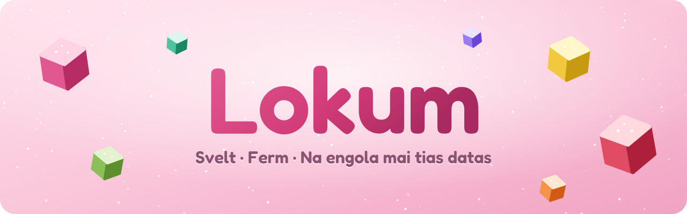

<p align="center">
  
</p>

<p align="center">
  <a href="../../README.md">English</a> ·
  <a href="README.tr.md">Türkçe</a> ·
  <a href="README.de.md">Deutsch</a> ·
  <a href="README.fr.md">Français</a> ·
  <a href="README.it.md">Italiano</a> ·
  <b>Rumantsch</b> ·
  <a href="README.es.md">Español</a> ·
  <a href="README.sv.md">Svenska</a> ·
  <a href="README.ko.md">한국어</a> ·
  <a href="README.ja.md">日本語</a> ·
  <a href="README.zh-CN.md">简体中文</a> ·
  <a href="README.zh-TW.md">繁體中文</a>
</p>

<p align="center">
  <a href="https://github.com/SametEge/Lokum/releases/latest"></a>
  <a href="https://github.com/SametEge/Lokum/releases"></a>
  
  
  <a href="../../LICENSE"></a>
</p>

**Lokum** è in navigatur da web construì sin Mozilla Firefox cun il gust dal
lokum tirc. El prenda il motor, la segirezza e las extensiuns en las qualas ti
has gia fidanza e las envolva en ina trav laterala en stil Arc, dudesch «gusts»
da colurs maschadads a maun, spazis, ina paletta da cumonds, animaziuns lommas
ed ina configuraziun iniziala fitg minuziusa — en dudesch linguas. Uschespert
ch'ina nova versiun è pronta, s'actualisescha el sez e senza canera via GitHub
Releases.

<p align="center">
  
  
</p>

---

## Cuntegn

<!-- toc -->
- [Telechargiar](#telechargiar)
- [Il meglier](#il-meglier)
- [Gusts](#gusts)
- [Disposiziuns: trav laterala u tabs classics](#disposiziuns-trav-laterala-u-tabs-classics)
- [Spazis](#spazis)
- [Paletta e trav da cumonds](#paletta-e-trav-da-cumonds)
- [Tabs che fan urden sez](#tabs-che-fan-urden-sez)
- [La tura da bainvegni](#la-tura-da-bainvegni)
- [Preferenzas](#preferenzas)
- [Sfera privata](#sfera-privata)
- [Linguas](#linguas)
- [Actualisaziuns automaticas](#actualisaziuns-automaticas)
- [Cumbinaziuns da tastas](#cumbinaziuns-da-tastas)
- [Installaziun](#installaziun)
- [Construir dal code da funtauna](#construir-dal-code-da-funtauna)
- [Co che Lokum funcziuna](#co-che-lokum-funcziuna)
- [Versiuns ed integraziun cuntinuada](#versiuns-ed-integraziun-cuntinuada)
- [Dumondas frequentas](#dumondas-frequentas)
- [Cooperar](#cooperar)
- [Licenza e marcas](#licenza-e-marcas)
<!-- /toc -->

---

## Telechargiar

Prenda la versiun la pli nova da la **[pagina da las versiuns](https://github.com/SametEge/Lokum/releases/latest)**.

| Datoteca | Per | Remartgas |
| --- | --- | --- |
| `Lokum-Setup-<versiun>-x64.exe` | Windows 10 / 11 (64 bit) | **Recumandà.** Vegn installà mo per tes utilisader, senza dretgs d'administratur, e s'actualisescha sez. |
| `Lokum-<versiun>-win64.zip` | Windows, portabel | Extrahar nua che ti vuls (era sin in stick USB) e lantschar `lokum.exe`. Ta infurmescha davart actualisaziuns. |
| `Lokum-<versiun>-linux-x86_64.tar.xz` | Linux (64 bit) | Extrahar e lantschar `./lokum`; `install-desktop-entry.sh` al agiunta al menu d'applicaziuns. |
| `latest.json`, `SHA256SUMS.txt` | Tuts | Manifest per l'actualisaziun integrada e summas da controlla SHA‑256 da mintga datoteca. |

> **Windows SmartScreen.** Lokum n'è anc betg suttascrit cun in certificat (quels
> èn memia chars per in project d'hobby); perquai po Windows dir a l'emprima
> aviada ch'el haja *protegì tes computer*. Clicca sin **Ulteriuras
> infurmaziuns → Tuttina exequir**. Ti pos adina cumparegliar la datoteca cun
> `SHA256SUMS.txt` sin la pagina da la versiun.

---

## Il meglier

- 🍬 **Dudesch gusts** — mintga tema è ina sort da lokum: Rosa, Pistazia, Citrona, Granat, Pomaranza, Menta, Lavanda, Mastix, Cocos, Caffè tirc, Mesanotg ed ina stgatla *Maschadà* animada. Mintgin cun ina retsetta clera ed ina stgira.
- 🧭 **Trav laterala en stil Arc _u_ tabs classics** — ina trav laterala sin l'entira autezza cun la trav d'adressas, ils tabs verticals da Firefox u la trav da tabs classica. Mida cura che ti vuls; la fanestra sa reorganisescha directamain.
- 🗂️ **Spazis** — separa Persunal, Lavur, Scola e Divertiment, mintgin cun agens tabs, atgna icona, agen gust e (sch'ins vul) agen container. Stritga u smatga <kbd>Ctrl</kbd>+<kbd>Alt</kbd>+<kbd>←</kbd>/<kbd>→</kbd> per midar.
- ⌨️ **Paletta da cumonds** (<kbd>Ctrl</kbd>+<kbd>K</kbd>) — tschertga approximativa tranter tabs averts e dapli che 40 acziuns, ed ina gronda **trav da cumonds flottanta** cura che ti cliccas en la trav d'adressas.
- 🎵 **Mini‑player** — reproducir, far pausa, sursiglir e metter senza tun musica u videos d'auters tabs directamain en la trav laterala.
- 🧹 **Tabs che fan urden sez** — archivar automaticamain tabs betg utilisads, laschar durmir tabs en il fund e reavrir tut da l'archiv.
- 🌟 **Ina tura da bainvegni sco nagina autra** — tscherna tes gust cun laschar crudar cubs 3D da lokum cun zutger, guarda co ch'il navigatur sa reorganisescha davos l'assistent, creescha spazis da models, importescha tes vegl navigatur e tscherna tes nivel da protecziun da datas. Confetti inclus.
- ⚙️ **Preferenzas che fan plaschair** — dudesch secziuns, tschertga immediata, prevista directa, export/import da tias preferenzas da Lokum.
- 🔒 **Privat da standard** — nagina telemetria, nagins studis, nagin cuntegn sponsurà; protecziun stretga cunter il fastizar ad in clic; uBlock Origin, DNS segir, mo HTTPS, GPC e protecziun cunter fingerprinting en las preferenzas.
- 🌍 **Dudesch linguas** — englais, tirc, tudestg, franzos, talian, rumantsch, spagnol, svedais, corean, giapunais, chinais simplifitgà e tradiziunal — per Lokum e per Firefox sez.
- 🔄 **Actualisaziuns automaticas** — novas versiuns vegnan construidas da GitHub Actions tar mintga midada e tar mintga nova versiun da Firefox ed installadas senza canera cura che ti serras Lokum.
- 🦊 **Il vair Firefox en l'intern** — versiuns uffizialas da Mozilla, il motor Gecko, tut las extensiuns da Firefox, Firefox Sync e las correcturas da segirezza da Mozilla uschespert ch'ellas cumparan.

---

## Gusts

In gust colurescha l'entir navigatur: il rom da la fanestra, la trav laterala,
la colur d'accent da buttuns e soms, la pagina «Nov tab» e las agnas paginas da
Lokum. Mintga gust ha ina retsetta clera ed ina stgira, e ti pos remplazzar
l'accent cun ina colur tenor tes gust. Spazis pon avair in agen gust — cura che
ti midas il spazi mida lura era la colur da la fanestra.

| | Gust | Atmosfera |
| --- | --- | --- |
| 🌹 | **Rosa** (Gül) | Il lokum classic cun aua da rosas, d'in rosa tener. *(standard)* |
| 🌰 | **Pistazia** (Fıstık) | Verd pistazia fresc, quiet e concentrà. |
| 🍋 | **Citrona** (Limon) | Scorsa da citrona sulegliva per damaun clers. |
| 🍎 | **Granat** (Nar) | Cotschen granat profund, curaschus e savurus. |
| 🍊 | **Pomaranza** (Portakal) | La glisch chauda da pomaranza e bergamotta. |
| 🌿 | **Menta** (Nane) | Menta frestga, viva sco in'aura da primavaira. |
| 💜 | **Lavanda** (Lavanta) | Lavanda lomma per suentermezdis da siemi. |
| 🤍 | **Mastix** (Sakız) | Ivur cremus da mastix, quiet ed elegant. |
| 🥥 | **Cocos** (Hindistan cevizi) | Alv cocos, net e minimal. |
| ☕ | **Caffè tirc** (Kahve) | Ils bruns rigs dal caffè tirc. |
| 🌙 | **Mesanotg** (Gece) | Prugna da mesanotg plain stailas per utschels da notg. |
| 🎨 | **Maschadà** (Karışık) | Ina stgatla da lokums maschadads che passa plaunsieu tras tut las colurs. |

Ils tests controllan mintga paletta: il text sto cuntanscher in contrast WCAG
da 4,5:1 sin ses rom ed ils buttuns d'accent 3:1 — en il modus cler ed en il
modus stgir.

Detagls supplementars che ti pos activar u deactivar: **zutger pulvra**
(pitschnas stailinas che sbrinzlan en la trav laterala), **grana lomma** (ina
fina textura da palpiri), chantuns radunds da la pagina, distanza dal rom,
sumbriva da la pagina, densitad da l'interfatscha (cumpact / normal /
confortabel), scrittira da l'interfatscha (sistem / radunda / cun serifas) e
trais nivels d'animaziun (cumplet, reducì — las colurs midan, ma nagut na sa
mova — u deactivà). Lokum respecta era la preferenza dal sistem *reducir
moviments*.

<p align="center">
  
</p>

---

## Disposiziuns: trav laterala u tabs classics

| Disposiziun | Co ch'ella para |
| --- | --- |
| **Trav laterala (stil Arc)** *(standard)* | Tabs, trav d'adressas e buttuns da navigaziun vivan en ina trav laterala sin l'entira autezza. La pagina flotta sin tes gust sco carta radunda; sura ina stretga trav da titel cun il titel da la pagina, la website ed in buttun *Copiar la colliaziun*. |
| **Tabs verticals** | Ils tabs verticals natifs da Firefox en ina trav laterala, la trav d'adressas sisum. Enconuschent e spazius. |
| **Tabs classics** | Tabs sisum, sco en mintga navigatur — adina en tes gust. |

<p align="center">
  
</p>

Ulteriuras opziuns da disposiziun:

- **Vart da la trav laterala** — sanestra u dretga.
- **Zuppentar la trav laterala (modus cumpact)** — <kbd>Ctrl</kbd>+<kbd>Alt</kbd>+<kbd>S</kbd>. La pagina occupa l'entira fanestra; la trav laterala cumpara cura che la mieur tutga l'ur da la fanestra.
- **Trav da cumonds flottanta** — la trav d'adressas s'avra gronda e centrada sur la pagina, sco en Arc.
- **Novs tabs cumparan** sisum u giudim en la glista.
- **Buttun per serrar tabs** cun passar sur, adina u mai.
- **Tabs fixads daventan favurits** — ina grilla da grondas iconas sisum en la trav laterala, adina la medema en mintga spazi.
- **Trav da segnapaginas**, **mini‑player** e **persunalisar la trav d'utensils**.

---

## Spazis

Spazis tegnan separadas las differentas parts da tia vita. Mintga spazi ha
atgna glista da tabs, in num, ina icona emoji, in gust facultativ che
colurescha la fanestra durant che ti es en el, ed in **container** da Firefox
facultativ — uschia resta tes spazi da Lavur p.ex. annunzià tar tes contos da
lavur.

- Mida il spazi cun las iconas giudim en la trav laterala, cun **stritgar lateralmain** sur la trav laterala (u <kbd>Shift</kbd> + rodella da la mieur), cun <kbd>Ctrl</kbd>+<kbd>Alt</kbd>+<kbd>←</kbd>/<kbd>→</kbd> u siglia directamain ad in spazi cun <kbd>Ctrl</kbd>+<kbd>Alt</kbd>+<kbd>1</kbd>…<kbd>9</kbd>.
- **Tira in tab sin l'icona d'in spazi** per al spustar, u utilisescha *Spustar en il spazi* en il menu dal tab.
- Clic dretg sin il num dal spazi: renumnar, midar icona, gust u container, svidar ils tabs, crear e stizzar spazis.
- Administrescha tut — era la successiun — en **Preferenzas → Spazis**.
- Ils spazis vegnan memorisads en tes profil (`lokum/spaces.json`), e mintga tab sa regorda da ses spazi era suenter ina nova aviada.

<p align="center">
  
</p>

---

## Paletta e trav da cumonds

Smatga <kbd>Ctrl</kbd>+<kbd>K</kbd> nua che ti vuls. Tippa in pèr letras e Lokum
chatta tabs averts ed acziuns cun ina tschertga approximativa: nov
tab/nova fanestra/fanestra privata, reavrir il tab serrà, duplitgar, fixar,
copiar la colliaziun, **vista partida** cun l'ultim tab, modus da lectura,
maletg‑en‑maletg, maletg dal visur, tschertgar, stampar, zoom, telechargiadas,
cronologia, segnapaginas, extensiuns, utensils per sviluppaders, stizzar la
cronologia recenta, modus stgir, mintga disposiziun, mintga gust, mintga spazi
e las preferenzas da Lokum u da Firefox. Tut il rest daventa ina tschertga en il
web.

<p align="center">
  
  
</p>

Cura che ti cliccas en la disposiziun cun trav laterala sin la trav d'adressas
(u smatgas <kbd>Ctrl</kbd>+<kbd>L</kbd>), daventa ella ina gronda **trav da
cumonds flottanta** en il center da la fanestra — cun tut las propostas, las
scursanidas da tschertga e la cronologia da Firefox, e bler spazi.

---

## Tabs che fan urden sez

- **Archiv automatic** — tabs betg fixads che ti n'has betg avert dapi 12 uras, in di, in'emna u in mais vegnan serrads e tegnids en l'**archiv** (fin 600 tabs). Tschertga e reavra tge che ti vuls en **Preferenzas → Archiv** u cun il buttun da biblioteca en la trav laterala.
- **Tabs che dorman** — tabs en il fund pon vegnir deschargiads suenter intginas minutas per spargnar memoria e battaria; cura che ti cliccas sin els, turnan els.
- **Mini‑player** — cura ch'in tab reproducescha medias, mussa ina pitschna carta en la trav laterala il maletg, il titel e l'artist cun precedent / reproducir‑pausa / proxim e senza tun.
- E tut quai che Firefox porta: **gruppas da tabs**, **vista partida**, prevista da tabs, **maletg‑en‑maletg** automatic e restauraziun da la sessiun.

---

## La tura da bainvegni

La emprima giada che ti avias Lokum, s'avra ina tura da bainvegni sin l'entir
visur sur il navigatur — ed il navigatur sa mida davosvart directamain, uschè
spert sco che ti tschernas.

<p align="center">
  
  
</p>

1. **Bainvegni** — in cub da lokum 3D che flotta, zutger che sgola ed ina tscherna da la lingua.
2. **Gust** — dudesch cubs cun zutger crodan en ina cuppa; tutga in e l'entir navigatur mida la colur cun ina nivla da zutger pulvra. Tscherna cler, stgir u automatic — u smatga **Surprenda mai** per ina roulette da gusts.
3. **Disposiziun** — trav laterala en stil Arc, tabs verticals u classics, vart da la trav e modus cumpact, cun prevista directa.
4. **Spazis** — cumenza cun Persunal ed agiunta Lavur, Scola e Divertiment cun in clic mintgin.
5. **Importar** — Lokum enconuscha ils auters navigaturs sin tes computer (Chrome, Edge, Brave, Opera, Vivaldi…) e prenda cun sai segnapaginas, pleds‑clav, cronologia e dapli.
6. **Sfera privata** — protecziun cunter il fastizar equilibrada u stretga, uBlock Origin, DNS segir; la telemetria è adina deactivada.
7. **Finì** — in resumaziun da tias tschernas, *definir Lokum sco mes navigatur standard* e confetti.

Ti pos far la tura anc ina giada da tut temp en **Preferenzas → Avanzà → Tura
da bainvegni**.

---

## Preferenzas

Avra las **Preferenzas da Lokum** cun <kbd>Ctrl</kbd>+<kbd>,</kbd>, dal menu
principal, da la trav laterala u cun tippar `about:lokum`. Mintga opziun ha
effect immediat, e la tschertga chatta mintga preferenza tenor ses num.

| Secziun | Tge che ti pos far |
| --- | --- |
| **Apparientscha** | Galaria da gusts, cler/stgir/automatic, atgna colur d'accent, zutger pulvra, grana, animaziuns, chantuns radunds, distanza dal rom, sumbriva da la pagina, densitad, scrittira da l'interfatscha. |
| **Disposiziun** | Trav laterala Arc / verticala / classica, vart da la trav, modus cumpact, trav da cumonds flottanta, posiziun da novs tabs, buttuns per serrar, mini‑player, trav da segnapaginas, persunalisar la trav d'utensils. |
| **Spazis** | Activar spazis, colurar la fanestra tenor spazi, stritgar per midar; agiuntar, renumnar, midar icona e gust, ordinar e stizzar spazis; tscherner containers. |
| **Tabs** | Archiv automatic, tabs che dorman, restaurar cun aviar, prevista da tabs, gruppas da tabs, vista partida, maletg‑en‑maletg automatic, confermar avant che terminar. |
| **Archiv** | Tschertgar, reavrir ed allontanar tabs archivads; svidar l'archiv. |
| **Sfera privata e segirezza** | Protecziun cunter il fastizar equilibrada/stretga, uBlock Origin cun in clic, modus mo HTTPS, DNS segir (Cloudflare, Quad9, Mullvad, NextDNS, AdGuard…), Global Privacy Control, protecziun cunter fingerprinting, stizzar la cronologia cun terminar, bloccar fanestras pop‑up. |
| **Tschertga** | Maschina da tschertgar standard, propostas, tschertgas popularas, administrar maschinas da tschertgar. |
| **Cumbinaziuns da tastas** | Tut las cumbinaziuns da Lokum, cun in som per las deactivar sch'ellas èn en conflict cun ina website. |
| **Lingua** | Lingua da l'interfatscha (dudesch inclusas), controlla da l'ortografia, linguas preferidas per websites. |
| **Actualisaziuns** | Versiun actuala, tschertgar ussa, tschertga ed installaziun automatica, chanal stabil/beta, interval, notas da publicaziun, tut las versiuns. |
| **Avanzà** | Navigatur standard, importar d'in auter navigatur, tura da bainvegni, export/import da las preferenzas da Lokum (JSON), ordinatur dal profil, restaurar las preferenzas da Lokum, rodlar lom, `userChrome.css` persunal, tut las preferenzas da Firefox, `about:config`. |
| **Davart Lokum** | Versiun, motor Firefox, data da construcziun, plattafurma, profil; colliaziuns per annunziar in problem, notas da publicaziun e licenzas. |

<p align="center">
  
</p>

Tut quai che Firefox porscha resta ad in clic en las **preferenzas da Firefox**
(`about:preferences`).

---

## Sfera privata

Lokum cumenza privat e resta privat:

- **Nagina telemetria, nagins studis, nagin rapport da collaps, nagin agent dal navigatur standard.** Els vegnan deactivads cun directivas d'interpresa (`distribution/policies.json`) ed allontanads dal pachet.
- **Nagin cuntegn sponsurà** — naginas scursanidas u artitgels sponsurads sin la pagina «Nov tab», nagin Pocket, naginas extensiuns u funcziuns «recumandadas».
- **Protecziun avanzada cunter il fastizar** da standard en il modus *equilibrà*, *stretg* ad in clic.
- **uBlock Origin** vegn installà cun in clic da la tura da bainvegni u da las preferenzas.
- Preferenzas predefinidas per **DNS segir**, modus **mo HTTPS**, **Global Privacy Control**, **protecziun cunter fingerprinting** e **stizzar cun terminar** en la secziun Sfera privata.

Cun tge che Lokum sez sa collia: `github.com` / `api.github.com` per tschertgar
actualisaziuns (quai pos ti deactivar en **Preferenzas → Actualisaziuns**). Tut
il rest è il cumportament normal da Firefox — p.ex. las glistas da Safe
Browsing, datas davart certificats revocads e la butia d'extensiuns — che ti pos
administrar en las preferenzas da sfera privata da Firefox.

---

## Linguas

Lokum cuntegna dudesch linguas e dovra a l'emprima aviada la lingua tschernida
en l'installaziun u la lingua da tes sistem operativ. Mida la lingua da tut temp
en **Preferenzas → Lingua** (ina nova aviada terminescha la midada dapertut).

| Lingua | Code | | Lingua | Code |
| --- | --- | --- | --- | --- |
| Englais (English) | `en` | | Spagnol (Español) | `es-ES` |
| Tirc (Türkçe) | `tr` | | Svedais (Svenska) | `sv-SE` |
| Tudestg (Deutsch) | `de` | | Corean (한국어) | `ko` |
| Franzos (Français) | `fr` | | Giapunais (日本語) | `ja` |
| Talian (Italiano) | `it` | | Chinais simplifitgà (简体中文) | `zh-CN` |
| Rumantsch | `rm` | | Chinais tradiziunal (繁體中文) | `zh-TW` |

L'interfatscha da Firefox sez deriva dals pachets da lingua uffizials da
Mozilla che la construcziun integrescha en l'applicaziun; las extensiuns da
Lokum (trav laterala, preferenzas, tura da bainvegni, actualisaziun…) dovran
pitschens dicziunaris JSON en `src/lokum/locales/`. In test garantescha che
mintga dicziunari saja cumplet e tegnia ils medems `{placeholders}` sco
l'englais. L'installaziun per Windows è disponibla en tut questas linguas
cun excepziun dal rumantsch.

---

## Actualisaziuns automaticas

1. Mintga sis uras (configurabel) telechargia Lokum la pitschna datoteca `latest.json` da la versiun la pli nova sin GitHub.
2. Sch'i dat ina versiun pli nova, cumpara ina carta en la trav laterala e l'installaziun vegn telechargiada en il fund — mo dals servers da telechargiada da GitHub.
3. La summa **SHA‑256** da la datoteca vegn cumparegliada cun `latest.json`; tut quai che na correspunda betg vegn stizzà.
4. Cura che ti serras Lokum vegn l'actualisaziun installada senza canera en il fund. La proxima giada che ti avras Lokum es ti sin la nova versiun, ed ina notificaziun *«Lokum è vegnì actualisà»* maina a las notas da publicaziun. **Reaviar ed actualisar** installescha immediatamain e reavra Lokum.

Tscherna en **Preferenzas → Actualisaziuns** il chanal **Stabil** u **Beta**,
l'interval da controlla u deactivescha l'installaziun automatica. L'ediziun zip
portabla ta infurmescha mo. L'actualisaziun da Firefox da Mozilla è
deactivada — las versiuns da Lokum portan il nov Firefox per tai.

---

## Cumbinaziuns da tastas

| Cumbinaziun | Acziun |
| --- | --- |
| <kbd>Ctrl</kbd>+<kbd>K</kbd> | Paletta da cumonds |
| <kbd>Ctrl</kbd>+<kbd>Alt</kbd>+<kbd>S</kbd> | Mussar / zuppentar la trav laterala (modus cumpact) |
| <kbd>Ctrl</kbd>+<kbd>Alt</kbd>+<kbd>→</kbd> / <kbd>←</kbd> | Proxim / precedent spazi |
| <kbd>Ctrl</kbd>+<kbd>Alt</kbd>+<kbd>1</kbd> … <kbd>9</kbd> | Ir al spazi 1–9 |
| <kbd>Ctrl</kbd>+<kbd>Shift</kbd>+<kbd>C</kbd> | Copiar la colliaziun da la pagina |
| <kbd>Ctrl</kbd>+<kbd>,</kbd> | Preferenzas da Lokum |
| <kbd>Ctrl</kbd>+<kbd>T</kbd> | Nov tab |
| <kbd>Ctrl</kbd>+<kbd>L</kbd> | Trav d'adressas (trav da cumonds flottanta) |
| <kbd>Ctrl</kbd>+<kbd>Shift</kbd>+<kbd>T</kbd> | Reavrir il tab serrà |

Tut las autras cumbinaziuns da tastas da Firefox funcziunan sco usità. Las
cumbinaziuns da Lokum sez pon vegnir deactivadas en **Preferenzas →
Cumbinaziuns da tastas**.

---

## Installaziun

### Windows (installaziun)

1. Telechargia `Lokum-Setup-<versiun>-x64.exe` da l'[ultima versiun](https://github.com/SametEge/Lokum/releases/latest).
2. Lantscha la datoteca (guarda la remartga davart SmartScreen survart), tscherna tia lingua, sche ti vuls ina scursanida sin il desktop e sche Lokum duai daventar tes navigatur standard, e clicca sin **Installar**.
3. Lokum vegn installà en `%LOCALAPPDATA%\Programs\Lokum` — per utilisader, senza dretgs d'administratur — e s'annunzia sco navigatur, uschia che ti al pos tscherner en **Parameters da Windows → Apps standard**.

Opziuns da la lingia da cumonds per installaziuns automatisadas:

| Opziun | Significaziun |
| --- | --- |
| `/S` | Installaziun senza canera |
| `/D=C:\via\Lokum` | Ordinatur d'installaziun (sto esser l'ultima opziun) |
| `/DESKTOP=0` | Nagina scursanida sin il desktop (standard `1`) |
| `/UPDATE` | Actualisar in'installaziun existenta (dovrà da l'actualisaziun) |
| `/RELAUNCH` | Lantschar Lokum a la fin |

Per deinstallar dovra **Parameters da Windows → Apps → Lokum**. La
deinstallaziun dumonda sche tes profil (segnapaginas, pleds‑clav, cronologia)
duai restar u vegnir stizzà era.

### Windows (portabel)

Extrahescha `Lokum-<versiun>-win64.zip` nua che ti vuls e lantscha `lokum.exe`.
L'ediziun portabla na tutga betg la registratura e ta infurmescha mo davart
actualisaziuns.

### Linux

```sh
tar -xJf Lokum-<versiun>-linux-x86_64.tar.xz
cd lokum
./lokum                      # lantschar
./install-desktop-entry.sh   # facultativ: agiuntar Lokum al menu d'applicaziuns
```

### Nua che tias datas èn

Lokum ha in agen profil, separà d'in Firefox eventualmain installà.
**Preferenzas → Avanzà → Ordinatur dal profil** al avra. Las datas specificas
da Lokum (spazis, archiv da tabs) èn en l'ordinatur `lokum` en il profil.

---

## Construir dal code da funtauna

Lokum na compilescha betg Firefox. La construcziun telechargia ina **versiun
uffiziala da Firefox** da `archive.mozilla.org`, la controllescha cun ils
`SHA512SUMS` da Mozilla e la transfurma en Lokum. Ina construcziun cumpletta per
Windows dura sin in computer normal paucas minutas, e pachets per Windows pon
vegnir construids sin Linux.

**Premissas**

- Python 3.10+
- Node.js 20+ (scriva da nov las iconas e las infurmaziuns da versiun da `lokum.exe` cun [resedit](https://github.com/jet2jet/resedit-js))
- `7z` (p7zip) per extrahar l'installaziun da Firefox per Windows, `tar` e `xz`
- NSIS 3 (`makensis`) per l'installaziun da Windows

Sin Ubuntu/Debian: `sudo apt install python3 nodejs npm p7zip-full nsis xz-utils`

**Construir**

```sh
git clone https://github.com/SametEge/Lokum.git
cd Lokum
npm ci --prefix scripts/pe          # ina giada, per construcziuns per Windows

# Installaziun per Windows + zip portabel da l'ultima versiun da Firefox
python3 scripts/build.py --platform win64

# Archiv per Linux sin ina tscherta versiun da Firefox
python3 scripts/build.py --platform linux-x86_64 --firefox-version 156.0
```

Ils resultats arrivan en `dist/`. Opziuns utilas:

| Opziun | Significaziun |
| --- | --- |
| `--platform {win64,win-arm64,linux-x86_64}` | Plattafurma finala |
| `--firefox-version X` | Versiun da Firefox da basa (standard: fixada en `firefox.json`, uschiglio la pli nova) |
| `--version X` | Versiun da Lokum (standard: `version.json` + `-dev`) |
| `--firefox-dir ORDINATUR` | Duvrar in Firefox gia extrahà empè da telechargiar |
| `--no-locales` | Sursiglir ils pachets da lingua (pli svelt) |
| `--no-installer` | Sursiglir NSIS |
| `--app-only` | Fermar suenter avair preparà l'ordinatur da l'applicaziun |

**Sviluppar cun in Firefox extrahà**

```sh
scripts/dev/install.sh /via/firefox        # copiescha il strat da Lokum en
/via/firefox/firefox --profile /tmp/lokum-dev --no-remote
```

Las pli bleras midadas en `src/lokum` dovran mo ina nova aviada dal navigatur.

**Tests**

```sh
node --test "tests/unit/*.test.mjs"      # logica da basa, contrast dals gusts
python3 tests/check_locales.py --strict  # dicziunaris cumplets
node scripts/dev/make_content_css.mjs --check
LOKUM_SELFTEST=out.json ./lokum --headless   # 25 controllas en il navigatur
```

`LOKUM_SELFTEST` lascha exequir in vair Lokum in autotest (disposiziun, spazis,
gusts, paletta da cumonds, paginas da preferenzas e da bainvegni, linguas,
marca, actualisaziun e directivas), scriver il resultat sco JSON e terminar. La
CI al exequescha sin Windows e Linux suenter avair installà ils pachets
construids da frestg.

---

## Co che Lokum funcziuna

```
versiun uffiziala da Firefox ──► controllar SHA512 ──► extrahar
        │
        ├─ integrar 11 pachets da lingua da Mozilla en omni.ja (+ glista plurilingua)
        ├─ remplazzar la marca Firefox (nums, logos, iconas) cun quella da Lokum
        ├─ agiuntar il strat da Lokum:  defaults/pref/lokum-autoconfig.js
        │                               lokum.cfg  (aviada autoconfig)
        │                               distribution/policies.json
        │                               browser/lokum/  (pachet chrome://lokum)
        ├─ allontanar actualisaziun, rapport da collaps, telemetria
        ├─ firefox.exe → lokum.exe, novas iconas ed infurmaziuns da versiun
        └─ pachetar: installaziun NSIS · zip portabel · archiv Linux
```

Tar l'aviada legia Firefox `lokum-autoconfig.js`, che chargia `lokum.cfg`. Quest
pitschen code d'aviada registrescha il pachet `chrome://lokum/` e lantscha
`LokumStartup.sys.mjs`, che collia tut il rest:

| Modul | Incumbensa |
| --- | --- |
| `LokumStartup` | Aviada/terminaziun, tura da bainvegni, notificaziun «actualisà», autotest |
| `LokumWindow` | Controller per fanestra: stils, attributs, trav da titel, modus cumpact, trav da cumonds flottanta, cumbinaziuns da tastas |
| `LokumFlavors` | Las dudesch palettas sco variablas CSS `light-dark()` |
| `LokumLayout` | Translatescha la disposiziun da Lokum en preferenzas da Firefox (trav laterala, tabs verticals) e plazzament da las travs d'utensils |
| `LokumSpaces` | Spazis: memorisar, midar, chau e pe da la trav laterala, menus, trair e laschar crudar |
| `LokumTabs` | Archiv automatic e tabs che dorman |
| `LokumCommandPalette` | Paletta <kbd>Ctrl</kbd>+<kbd>K</kbd> |
| `LokumMediaCard` | Mini‑player en la trav laterala |
| `LokumUpdater` | Tschertga d'actualisaziuns, telechargiadas verifitgadas, installaziun senza canera cun terminar |
| `LokumI18n` | Dicziunaris da Lokum e tscherna da la lingua a l'emprima aviada |
| `LokumShell` | Integraziun en Windows sco navigatur standard |
| `LokumContentStyles` | Vestgescha la pagina «Nov tab» e las preferenzas da Firefox cun il gust activ |
| `LokumAboutPages` | `about:lokum` (preferenzas) ed `about:lokum-welcome` (tura) |
| `LokumSelfTest` | Autotest en il navigatur, duvrà da la CI |

Structura dal repository:

```
src/app/            datotecas sper il program da Firefox (autoconfig, directivas)
src/lokum/          il pachet chrome://lokum
  modules/          moduls JavaScript (survart)
  styles/           stils da l'interfatscha (tokens, rom, disposiziun, cumponentas, animaziuns)
  pages/            preferenzas about:lokum e tura da bainvegni
  locales/          dicziunaris da Lokum (12 linguas)
  images/           iconas e logos
scripts/build.py    la construcziun (guarda scripts/lokumbuild/)
scripts/release.py  planisaziun da versiuns, latest.json, notas da publicaziun
scripts/pe/         resursas dal program per Windows (resedit)
installer/          installaziun NSIS e sias translaziuns
branding/           funtaunas dal logo ed iconas generadas
tests/              tests d'unitad, controlla da linguas, smoke tests
.github/workflows/  CI, construcziuns e publicaziuns automaticas
```

---

## Versiuns ed integraziun cuntinuada

- **Mintga pull request e mintga push sin in branch** exequescha ils tests d'unitad e da linguas, construescha pachets per Windows e Linux, als installescha sin vairs computers Windows e Linux ed exequescha l'autotest en il navigatur.
- **Mintga push sin `main`** fa il medem e publitgescha lura ina **nova versiun sin GitHub** cun installaziun, zip portabel, archiv Linux, `latest.json`, `SHA256SUMS.txt` e notas da publicaziun generadas. Las copias installadas s'actualiseschan da quai.
- **Mintga sis uras** dumonda ina lavur planisada Mozilla tge ch'è l'ultima versiun da Firefox; sch'ella è pli nova che quella da l'ultima publicaziun, vegn Lokum construì da nov sin ella e publitgà automaticamain — uschia arrivan las correcturas da segirezza tar tai senza che insatgi stoppia far insatge.
- Publicaziuns pon era vegnir lantschadas a maun (**Actions → Release → Run workflow**), facultativamain cun ina tscherta versiun da Firefox u sco versiun preliminara beta.

Ils numers da versiun derivan da `version.json`; mintga publicaziun augmenta
automaticamain il numer da patch. Sche necessari pos ti fixar ina versiun da
Firefox cun ina datoteca `firefox.json` (`{"version": "156.0"}`).

---

## Dumondas frequentas

**È Lokum in fork da Firefox?**
Betg en il senn d'in agen motor. Lokum pachetescha da nov las versiuns
uffizialas da Firefox da Mozilla ed agiunta in agen strat d'interfatscha —
ti survegns pia exact il motor, la prestaziun, la cumpatibilitad cun il web e
las correcturas da segirezza da Firefox.

**Funcziunan las extensiuns da Firefox?**
Gea — tut las extensiuns da [addons.mozilla.org](https://addons.mozilla.org) funcziunan.

**Poss jau duvrar Firefox Sync?**
Gea. S'annunzia en las **preferenzas da Firefox → Sync** per sincronisar
segnapaginas, pleds‑clav, cronologia, tabs ed extensiuns cun Firefox sin tes
auters apparats.

**Mida u legia Lokum mes Firefox existent?**
Na. Lokum ha in agen profil. Dovra il pass d'import (u **Preferenzas → Avanzà →
Importar**) sche ti vuls prender cun tai tias datas.

**Pertge ma avertescha mes antivirus / SmartScreen?**
L'installaziun n'è anc betg suttascritta. Cumpareglia la datoteca cun
`SHA256SUMS.txt` sin la pagina da la versiun u construescha Lokum sez.

**Datti ina versiun per macOS?**
Anc betg. Windows e Linux vegnan construids e testads tar mintga midada.

**Suenter in'actualisaziun para insatge fauss. Co restaurar?**
**Preferenzas → Avanzà → Restaurar las preferenzas da Lokum** restaurescha
mintga opziun da Lokum, ma tegna tes tabs, spazis e datas.

---

## Cooperar

Rapports d'errurs, ideas, translaziuns e pull requests èn fitg bainvegnids.

- Annunzia errurs ed ideas en las [Issues](https://github.com/SametEge/Lokum/issues).
- Per meglierar ina translaziun, modifitgescha `src/lokum/locales/<code>.json` (ed `installer/strings.nsh` per l'installaziun) ed exequescha `python3 tests/check_locales.py --strict`.
- Per agiuntar in gust, agiunta ina paletta en `src/lokum/modules/LokumFlavors.sys.mjs`, ses num e sia descripziun en mintga dicziunari ed exequescha `node scripts/dev/make_content_css.mjs` ed ils tests d'unitad (els controllan il contrast).
- Exequescha per plaschair ils tests survart avant che avrir ina pull request.

---

## Licenza e marcas

Il code da funtauna da Lokum stat sut la
[Mozilla Public License 2.0](../../LICENSE), la medema licenza sco Firefox.

Firefox ed il logo da Firefox èn marcas da la Mozilla Foundation. Lokum è in
project independent, betg collià cun Mozilla e betg sustegnì da Mozilla; el
vegn construì da las versiuns uffizialas da Mozilla ed allontanescha da quellas
la marca Firefox. Arc è ina marca da The Browser Company, che n'è era betg
colliada cun Lokum — Lokum è mo inspirà da sias ideas. uBlock Origin è da
Raymond Hill e ses collavuraturs.

<p align="center"><sub>Fatg cun 🍬 e Firefox.</sub></p>
