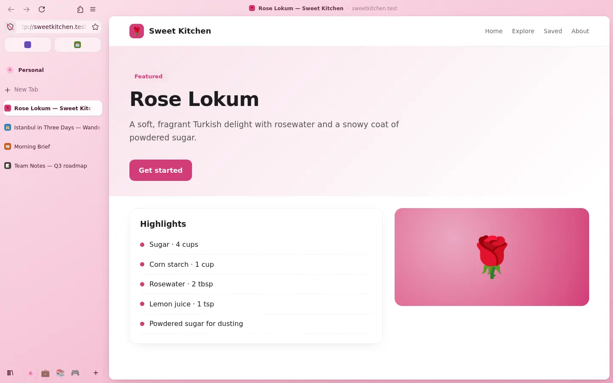
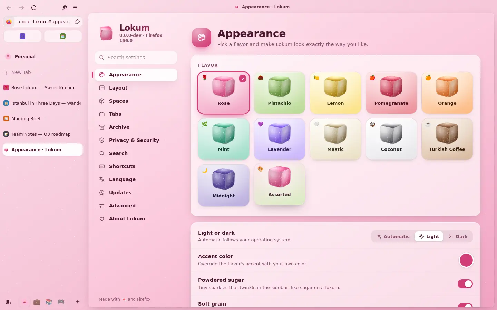
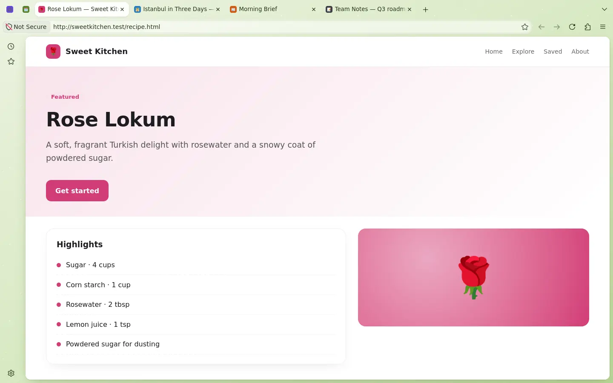
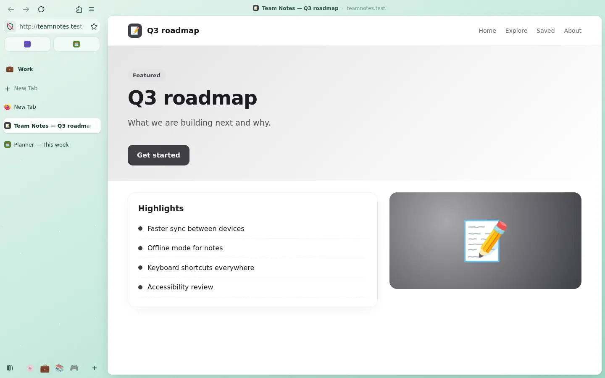
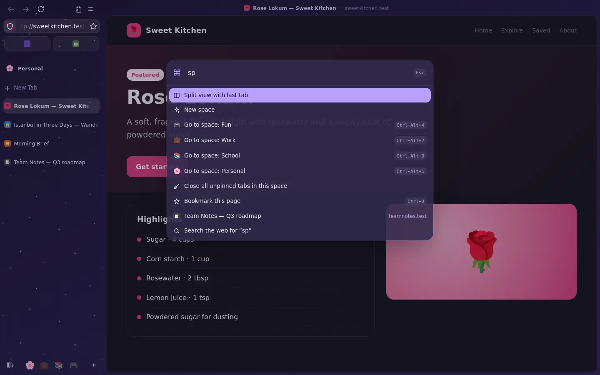
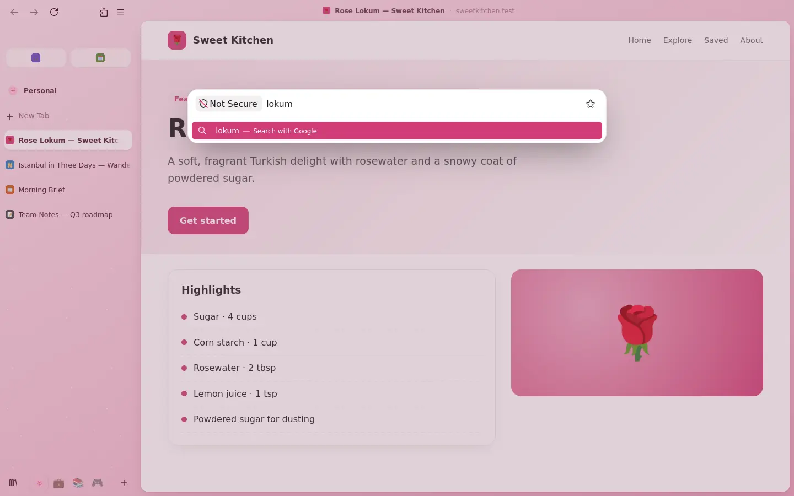
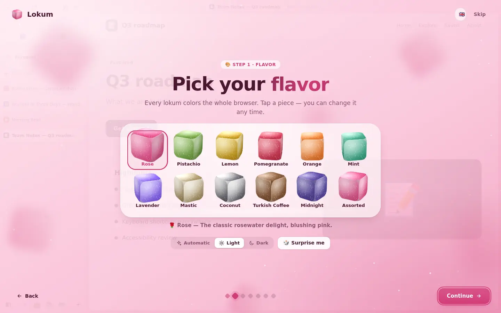
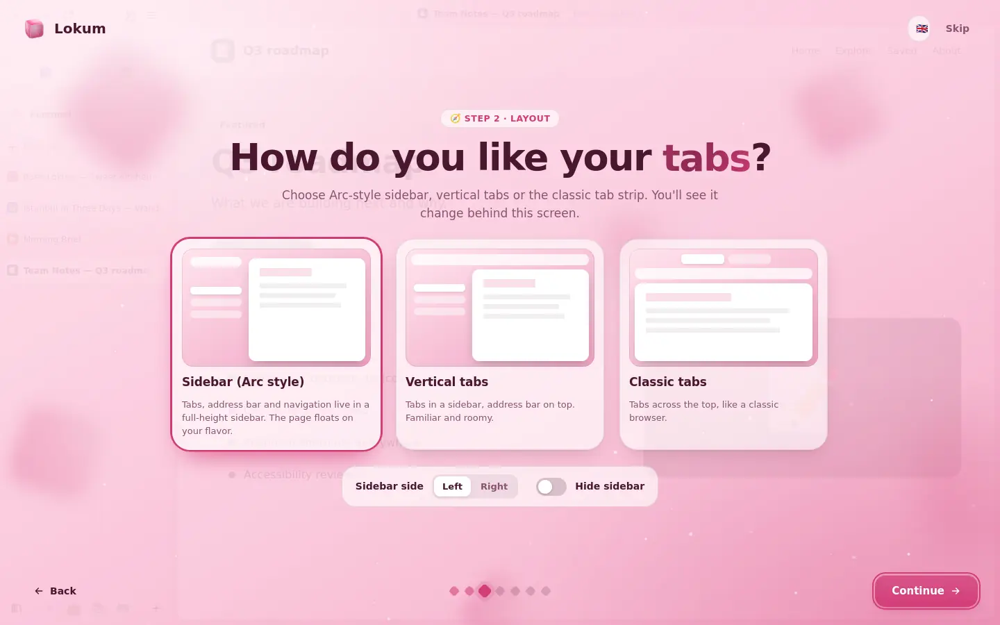
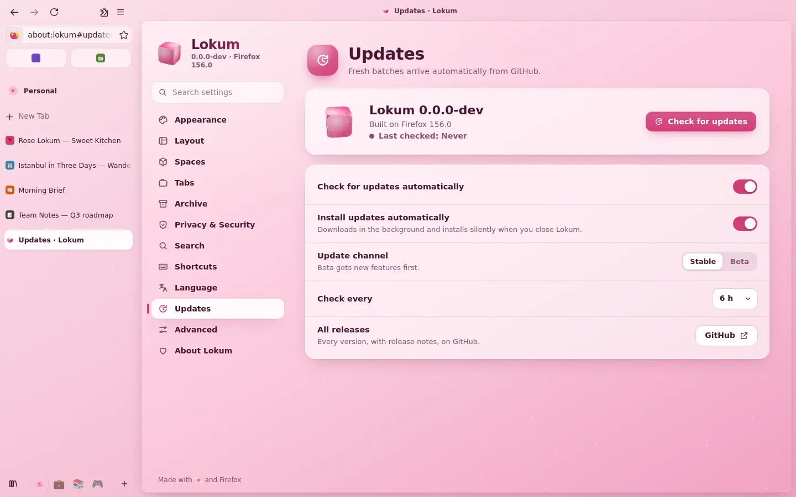

<p align="center">
  
</p>

<p align="center">
  <a href="../../README.md">English</a> ·
  <a href="README.tr.md">Türkçe</a> ·
  <a href="README.de.md">Deutsch</a> ·
  <a href="README.fr.md">Français</a> ·
  <a href="README.it.md">Italiano</a> ·
  <a href="README.rm.md">Rumantsch</a> ·
  <a href="README.es.md">Español</a> ·
  <a href="README.sv.md">Svenska</a> ·
  <a href="README.ko.md">한국어</a> ·
  <a href="README.ja.md">日本語</a> ·
  <a href="README.zh-CN.md">简体中文</a> ·
  <b>繁體中文</b>
</p>

<p align="center">
  <a href="https://github.com/SametEge/Lokum/releases/latest"></a>
  <a href="https://github.com/SametEge/Lokum/releases"></a>
  
  
  <a href="../../LICENSE"></a>
</p>

**Lokum** 是一款以 Mozilla Firefox 打造、帶著土耳其軟糖（Lokum）風味的網頁瀏覽器。
它保留了你早已信任的引擎、安全性與擴充套件，再用 Arc 風格的側邊欄、十二種手工調配的
顏色「口味」、空間（Spaces）、命令面板、柔和的動畫，以及格外用心的首次設定把它們包裝
起來——支援十二種語言。新版本一準備好，它就會透過 GitHub Releases 悄悄地自動更新。

<p align="center">
  
  
</p>

---

## 目錄

<!-- toc -->
- [下載](#下載)
- [特色](#特色)
- [口味](#口味)
- [版面配置：側邊欄或經典分頁](#版面配置側邊欄或經典分頁)
- [空間](#空間)
- [命令面板與命令列](#命令面板與命令列)
- [會自己整理的分頁](#會自己整理的分頁)
- [歡迎導覽](#歡迎導覽)
- [設定](#設定)
- [隱私](#隱私)
- [語言](#語言)
- [自動更新](#自動更新)
- [鍵盤快速鍵](#鍵盤快速鍵)
- [安裝](#安裝)
- [從原始碼建置](#從原始碼建置)
- [Lokum 的運作方式](#lokum-的運作方式)
- [發布與持續整合](#發布與持續整合)
- [常見問題](#常見問題)
- [參與貢獻](#參與貢獻)
- [授權條款與商標](#授權條款與商標)
<!-- /toc -->

---

## 下載

請到 **[版本發布頁面](https://github.com/SametEge/Lokum/releases/latest)** 取得最新版本。

| 檔案 | 適用於 | 說明 |
| --- | --- | --- |
| `Lokum-Setup-<版本>-x64.exe` | Windows 10 / 11（64 位元） | **推薦。** 只為目前的使用者安裝，不需要系統管理員權限，會自動更新。 |
| `Lokum-<版本>-win64.zip` | Windows 可攜版 | 解壓縮到任何地方（USB 隨身碟也可以）並執行 `lokum.exe`。有更新時會提醒你。 |
| `Lokum-<版本>-linux-x86_64.tar.xz` | Linux（64 位元） | 解壓縮後執行 `./lokum`；`install-desktop-entry.sh` 可將它加入應用程式選單。 |
| `latest.json`、`SHA256SUMS.txt` | 所有人 | 內建更新程式使用的更新清單，以及每個檔案的 SHA‑256 檢查碼。 |

> **關於 Windows SmartScreen。** Lokum 目前還沒有程式碼簽章（對個人專案來說憑證太貴），
> 所以第一次執行時 Windows 可能會顯示 *「Windows 已保護您的電腦」*。請按
> **其他資訊 → 仍要執行**。你隨時可以用版本頁面上的 `SHA256SUMS.txt` 驗證檔案。

---

## 特色

- 🍬 **十二種口味** —— 每個主題都是一種軟糖：玫瑰、開心果、檸檬、石榴、柳橙、薄荷、薰衣草、乳香、椰子、土耳其咖啡、午夜，以及會動的 *綜合* 禮盒。每種都有淺色與深色配方。
- 🧭 **Arc 風格側邊欄，_或_ 經典分頁** —— 內含網址列的全高側邊欄、Firefox 的垂直分頁，或經典的分頁列。隨時切換，視窗會即時重新排列。
- 🗂️ **空間** —— 把個人、工作、學業和娛樂分開，每個空間都有自己的分頁、圖示、口味，以及（可選的）容器。滑動或按 <kbd>Ctrl</kbd>+<kbd>Alt</kbd>+<kbd>←</kbd>/<kbd>→</kbd> 切換。
- ⌨️ **命令面板**（<kbd>Ctrl</kbd>+<kbd>K</kbd>）—— 在已開啟的分頁與 40 多個動作中模糊搜尋；點擊網址列時還會出現大大的 **浮動命令列**。
- 🎵 **迷你播放器** —— 直接在側邊欄播放、暫停、切換和靜音其他分頁中的音樂或影片。
- 🧹 **會自己整理的分頁** —— 自動封存一段時間沒開啟的分頁，讓背景分頁休眠，隨時從封存中重新開啟。
- 🌟 **獨一無二的歡迎導覽** —— 讓裹著糖粉的 3D 軟糖方塊落下來挑選口味，看著瀏覽器在精靈後方重新排列，用範本建立空間，從舊瀏覽器匯入資料，選擇隱私等級。還有彩帶慶祝。
- ⚙️ **用起來很愉快的設定頁** —— 十二個區段、即時搜尋、即時預覽，並可匯出／匯入 Lokum 設定。
- 🔒 **預設即隱私** —— 沒有遙測、沒有研究、沒有贊助內容；嚴格的追蹤保護一鍵即得；uBlock Origin、安全 DNS、純 HTTPS 模式、GPC 與數位指紋保護都在設定中。
- 🌍 **十二種語言** —— 英文、土耳其文、德文、法文、義大利文、羅曼什文、西班牙文、瑞典文、韓文、日文、簡體中文與繁體中文，Lokum 與 Firefox 本身都適用。
- 🔄 **自動更新** —— 每次有變更、以及 Mozilla 每次推出新版 Firefox 時，GitHub Actions 都會建置新版本，並在你關閉 Lokum 時靜默安裝。
- 🦊 **核心是真正的 Firefox** —— Mozilla 官方建置、Gecko 引擎、所有 Firefox 附加元件、Firefox Sync，以及 Mozilla 第一時間推出的安全性修正。

---

## 口味

口味會為整個瀏覽器上色：視窗外框、側邊欄、按鈕與開關的強調色、新分頁頁面，以及
Lokum 自己的頁面。每種口味都有淺色與深色配方，強調色也可以換成你喜歡的任何顏色。
空間可以擁有自己的口味——切換空間時，視窗顏色也會跟著改變。

| | 口味 | 氛圍 |
| --- | --- | --- |
| 🌹 | **玫瑰**（Gül） | 經典玫瑰水軟糖，泛著紅暈的粉色。*（預設）* |
| 🌰 | **開心果**（Fıstık） | 清新的開心果綠，平靜又專注。 |
| 🍋 | **檸檬**（Limon） | 陽光般的檸檬皮，點亮明亮的早晨。 |
| 🍎 | **石榴**（Nar） | 深邃的石榴紅，大膽又多汁。 |
| 🍊 | **柳橙**（Portakal） | 柳橙與佛手柑的溫暖光澤。 |
| 🌿 | **薄荷**（Nane） | 清涼薄荷，像春風一樣清爽。 |
| 💜 | **薰衣草**（Lavanta） | 柔和的薰衣草，陪你度過夢幻的午後。 |
| 🤍 | **乳香**（Sakız） | 奶油般的乳香象牙白，安靜又優雅。 |
| 🥥 | **椰子**（Hindistan cevizi） | 椰子白，乾淨而簡約。 |
| ☕ | **土耳其咖啡**（Kahve） | 濃郁的土耳其咖啡棕。 |
| 🌙 | **午夜**（Gece） | 為夜貓子準備的星空午夜梅紫。 |
| 🎨 | **綜合**（Karışık） | 一盒綜合軟糖，緩緩流轉過每一種顏色。 |

測試會檢查每個調色盤：無論淺色或深色模式，文字在外框上的 WCAG 對比度都必須達到
4.5:1，強調按鈕必須達到 3:1。

可以開關的額外細節：**糖粉**（側邊欄中閃爍的細小光點）、**柔和顆粒**（細緻的紙張
紋理）、頁面圓角、外框間距、頁面陰影、介面密度（緊湊／標準／寬鬆）、介面字型
（系統／圓體／襯線），以及三段動畫（完整、減少——顏色漸變但不移動——或關閉）。
Lokum 也會遵循系統的 *減少動態效果* 設定。

<p align="center">
  
</p>

---

## 版面配置：側邊欄或經典分頁

| 版面配置 | 外觀 |
| --- | --- |
| **側邊欄（Arc 風格）** *（預設）* | 分頁、網址列與導覽按鈕都在同一個全高側邊欄中。頁面像一張圓角卡片懸浮在口味之上，上方的細標題列顯示頁面標題、網站與 *複製連結* 按鈕。 |
| **垂直分頁** | 側邊欄中是 Firefox 原生的垂直分頁，網址列在頂端。熟悉又寬敞。 |
| **經典分頁** | 像所有瀏覽器一樣把分頁放在頂端——依然穿著你選的口味。 |

<p align="center">
  
</p>

更多版面配置選項：

- **側邊欄位置** —— 左側或右側。
- **隱藏側邊欄（緊湊模式）** —— <kbd>Ctrl</kbd>+<kbd>Alt</kbd>+<kbd>S</kbd>。頁面占滿整個視窗，游標碰到視窗邊緣時側邊欄會滑出。
- **浮動命令列** —— 像 Arc 一樣，網址列在頁面中央大大展開。
- **新分頁出現在** 清單頂端或底部。
- **分頁關閉按鈕** —— 滑鼠移過時、總是或永不顯示。
- **釘選的分頁會成為最愛** —— 側邊欄頂端的大圖示格線，在所有空間中都一樣。
- **書籤工具列**、**迷你播放器** 與 **自訂工具列**。

---

## 空間

空間讓生活的不同部分各就各位。每個空間都有自己的分頁清單、名稱、表情符號圖示、一個
可選的口味（在該空間時為視窗重新上色）以及一個可選的 Firefox **容器**——例如，工作
空間可以一直保持工作帳號的登入狀態。

- 用側邊欄底部的圖示、在側邊欄上 **左右滑動**（或 <kbd>Shift</kbd> + 滾輪）、按 <kbd>Ctrl</kbd>+<kbd>Alt</kbd>+<kbd>←</kbd>/<kbd>→</kbd> 切換，或用 <kbd>Ctrl</kbd>+<kbd>Alt</kbd>+<kbd>1</kbd>…<kbd>9</kbd> 直接跳過去。
- **把分頁拖曳到空間圖示上** 即可移動，也可以在分頁的右鍵選單中選擇 *移動到空間*。
- 在空間名稱上按右鍵可以重新命名、更換圖示、口味或容器、清空分頁，以及新增和刪除空間。
- 在 **設定 → 空間** 中管理一切，包括排序。
- 空間會儲存在你的設定檔中（`lokum/spaces.json`），每個分頁在重新啟動後仍會記得自己屬於哪個空間。

<p align="center">
  
</p>

---

## 命令面板與命令列

隨時按 <kbd>Ctrl</kbd>+<kbd>K</kbd>。輸入幾個字母，Lokum 就會用模糊比對找到已開啟的
分頁與動作：開新分頁／視窗／隱私視窗、重新開啟已關閉的分頁、複製分頁、釘選、複製連結、
與上一個分頁 **分割檢視**、閱讀模式、子母畫面、螢幕截圖、尋找、列印、縮放、下載、瀏覽
紀錄、書籤、擴充套件、開發者工具、清除最近的瀏覽紀錄、深色模式、每種版面配置、每種
口味、每個空間，以及 Lokum 或 Firefox 設定。其他輸入都會變成網路搜尋。

<p align="center">
  
  
</p>

在側邊欄版面中點擊網址列（或按 <kbd>Ctrl</kbd>+<kbd>L</kbd>）時，它會變成視窗中央的
大型 **浮動命令列**——Firefox 的所有建議、搜尋捷徑與瀏覽紀錄都在其中，空間寬敞。

---

## 會自己整理的分頁

- **自動封存** —— 12 小時、一天、一週或一個月沒開啟的未釘選分頁會被關閉並保存在 **封存** 中（最多 600 個）。在 **設定 → 封存** 或側邊欄的收藏庫按鈕中搜尋並重新開啟。
- **休眠分頁** —— 背景分頁可在幾分鐘後卸載，以節省記憶體與電力；點擊時會重新載入。
- **迷你播放器** —— 分頁播放媒體時，側邊欄中的小卡片會顯示封面、標題與演出者，並提供上一首／播放‑暫停／下一首與靜音。
- 以及 Firefox 內建的一切：**分頁群組**、**分割檢視**、分頁預覽、自動 **子母畫面** 與工作階段還原。

---

## 歡迎導覽

第一次啟動 Lokum 時，瀏覽器上方會開啟全螢幕的歡迎導覽——你每做一個選擇，後方的
瀏覽器都會即時變化。

<p align="center">
  
  
</p>

1. **歡迎** —— 懸浮的 3D 軟糖方塊、飄落的糖粉，以及語言切換。
2. **口味** —— 十二塊裹著糖粉的方塊落進托盤；點一塊，整個瀏覽器就會在一陣糖粉中變色。選擇淺色、深色或自動，或按 **給我驚喜** 來一次口味輪盤。
3. **版面配置** —— Arc 風格側邊欄、垂直分頁或經典分頁，以及側邊欄位置和緊湊模式，即時預覽。
4. **空間** —— 從個人開始，一鍵加入工作、學業和娛樂範本。
5. **匯入** —— Lokum 會偵測電腦上的其他瀏覽器（Chrome、Edge、Brave、Opera、Vivaldi…），並匯入書籤、密碼、瀏覽紀錄等。
6. **隱私** —— 平衡或嚴格的追蹤保護、uBlock Origin、安全 DNS；遙測永遠關閉。
7. **完成** —— 你的選擇摘要、*將 Lokum 設為預設瀏覽器*，還有彩帶。

你可以隨時在 **設定 → 進階 → 歡迎導覽** 中重新執行。

---

## 設定

用 <kbd>Ctrl</kbd>+<kbd>,</kbd>、主選單、側邊欄或輸入 `about:lokum` 開啟
**Lokum 設定**。所有選項即時生效，搜尋框可以用名稱找到任何設定。

| 區段 | 你可以做什麼 |
| --- | --- |
| **外觀** | 口味藝廊、淺色／深色／自動、自訂強調色、糖粉、顆粒、動畫、圓角程度、外框間距、頁面陰影、密度、介面字型。 |
| **版面配置** | Arc 側邊欄／垂直／經典、側邊欄位置、緊湊模式、浮動命令列、新分頁位置、關閉按鈕、迷你播放器、書籤工具列、自訂工具列。 |
| **空間** | 啟用空間、依空間為視窗上色、滑動切換；新增、重新命名、更換圖示與口味、排序和刪除空間；選擇容器。 |
| **分頁** | 自動封存、休眠分頁、啟動時還原、分頁預覽、分頁群組、分割檢視、自動子母畫面、結束前確認。 |
| **封存** | 搜尋、重新開啟與移除已封存的分頁；清空封存。 |
| **隱私權與安全性** | 平衡／嚴格追蹤保護、一鍵安裝 uBlock Origin、純 HTTPS 模式、安全 DNS（Cloudflare、Quad9、Mullvad、NextDNS、AdGuard…）、Global Privacy Control、數位指紋保護、結束時清除瀏覽紀錄、封鎖彈出型視窗。 |
| **搜尋** | 預設搜尋引擎、搜尋建議、熱門搜尋、管理搜尋引擎。 |
| **快速鍵** | 所有 Lokum 快速鍵，以及在與網站衝突時關閉它們的開關。 |
| **語言** | 介面語言（內建十二種）、拼字檢查、網站偏好語言。 |
| **更新** | 目前版本、立即檢查、自動檢查與安裝、穩定版／Beta 版頻道、檢查間隔、發行說明、所有版本。 |
| **進階** | 預設瀏覽器、從其他瀏覽器匯入、歡迎導覽、匯出／匯入 Lokum 設定（JSON）、設定檔資料夾、重設 Lokum 設定、平滑捲動、自訂 `userChrome.css`、所有 Firefox 設定、`about:config`。 |
| **關於 Lokum** | 版本、Firefox 引擎、建置日期、平台、設定檔；回報問題、發行說明與授權條款連結。 |

<p align="center">
  
</p>

Firefox 提供的一切，依然在 **Firefox 設定**（`about:preferences`）中一鍵可及。

---

## 隱私

Lokum 從一開始就重視隱私，而且一直如此：

- **沒有遙測、沒有研究、沒有當機回報程式、沒有預設瀏覽器代理程式。** 它們透過企業原則（`distribution/policies.json`）關閉，並從安裝套件中移除。
- **沒有贊助內容** —— 新分頁上沒有贊助的捷徑或文章，沒有 Pocket，也沒有「推薦」的擴充套件或功能。
- **加強型追蹤保護** 預設為 *平衡* 模式，*嚴格* 模式一鍵即得。
- **uBlock Origin** 可在歡迎導覽或設定中一鍵安裝。
- 隱私區段提供 **安全 DNS** 預設組合、**純 HTTPS** 模式、**Global Privacy Control**、**數位指紋保護** 與 **結束時清除**。

Lokum 本身會連線的位址：用於檢查更新的 `github.com` / `api.github.com`（可在
**設定 → 更新** 中關閉）。其他一切都是 Firefox 的正常行為——例如安全瀏覽清單、
憑證撤銷資料與附加元件商店——你可以在 Firefox 自己的隱私權設定中管理。

---

## 語言

Lokum 內建十二種語言，第一次啟動時會使用安裝程式中選擇的語言或作業系統語言。可隨時在
**設定 → 語言** 中切換（重新啟動後在所有地方生效）。

| 語言 | 代碼 | | 語言 | 代碼 |
| --- | --- | --- | --- | --- |
| 英文（English） | `en` | | 西班牙文（Español） | `es-ES` |
| 土耳其文（Türkçe） | `tr` | | 瑞典文（Svenska） | `sv-SE` |
| 德文（Deutsch） | `de` | | 韓文（한국어） | `ko` |
| 法文（Français） | `fr` | | 日文（日本語） | `ja` |
| 義大利文（Italiano） | `it` | | 簡體中文（简体中文） | `zh-CN` |
| 羅曼什文（Rumantsch） | `rm` | | 繁體中文 | `zh-TW` |

Firefox 本身的介面來自 Mozilla 官方語言套件，建置時會合併進應用程式；Lokum 新增的部分
（側邊欄、設定、歡迎導覽、更新程式…）使用 `src/lokum/locales/` 中的小型 JSON
字典。有測試確保每個字典都完整，並與英文保持相同的 `{預留位置}`。Windows 安裝程式
支援除羅曼什文以外的所有這些語言。

---

## 自動更新

1. Lokum 每六小時（可調整）從最新的 GitHub 版本下載小小的 `latest.json` 檔案。
2. 如果有更新的版本，側邊欄會出現一張卡片，安裝程式在背景下載——只從 GitHub 的版本下載伺服器取得。
3. 檔案的 **SHA‑256** 會與 `latest.json` 比對，不一致的一律丟棄。
4. 關閉 Lokum 時，更新會在背景靜默安裝。下次開啟時你已經在使用新版本，*「Lokum 已更新」* 通知會帶你查看發行說明。**重新啟動並更新** 會立即安裝並重新開啟 Lokum。

可在 **設定 → 更新** 中選擇 **穩定版** 或 **Beta 版** 頻道、檢查間隔，或關閉自動
安裝。可攜 zip 版只會提醒。Mozilla 自己的 Firefox 更新程式已停用——新的 Firefox 會
隨 Lokum 版本一起送到。

---

## 鍵盤快速鍵

| 快速鍵 | 動作 |
| --- | --- |
| <kbd>Ctrl</kbd>+<kbd>K</kbd> | 命令面板 |
| <kbd>Ctrl</kbd>+<kbd>Alt</kbd>+<kbd>S</kbd> | 顯示／隱藏側邊欄（緊湊模式） |
| <kbd>Ctrl</kbd>+<kbd>Alt</kbd>+<kbd>→</kbd> / <kbd>←</kbd> | 下一個／上一個空間 |
| <kbd>Ctrl</kbd>+<kbd>Alt</kbd>+<kbd>1</kbd> … <kbd>9</kbd> | 前往空間 1–9 |
| <kbd>Ctrl</kbd>+<kbd>Shift</kbd>+<kbd>C</kbd> | 複製頁面連結 |
| <kbd>Ctrl</kbd>+<kbd>,</kbd> | Lokum 設定 |
| <kbd>Ctrl</kbd>+<kbd>T</kbd> | 開新分頁 |
| <kbd>Ctrl</kbd>+<kbd>L</kbd> | 網址列（浮動命令列） |
| <kbd>Ctrl</kbd>+<kbd>Shift</kbd>+<kbd>T</kbd> | 重新開啟已關閉的分頁 |

其他 Firefox 快速鍵照常可用。Lokum 自己的快速鍵可在 **設定 → 快速鍵** 中關閉。

---

## 安裝

### Windows（安裝程式）

1. 從 [最新版本](https://github.com/SametEge/Lokum/releases/latest) 下載 `Lokum-Setup-<版本>-x64.exe`。
2. 執行它（參見上方的 SmartScreen 說明），選擇語言、是否建立桌面捷徑、是否將 Lokum 設為預設瀏覽器，然後按 **安裝**。
3. Lokum 會安裝到 `%LOCALAPPDATA%\Programs\Lokum`——依使用者安裝，不需要系統管理員權限——並註冊為瀏覽器，因此你可以在 **Windows 設定 → 預設應用程式** 中選擇它。

用於指令碼安裝的命令列參數：

| 參數 | 意義 |
| --- | --- |
| `/S` | 靜默安裝 |
| `/D=C:\路徑\Lokum` | 安裝資料夾（必須放在最後） |
| `/DESKTOP=0` | 不建立桌面捷徑（預設 `1`） |
| `/UPDATE` | 更新現有安裝（供更新程式使用） |
| `/RELAUNCH` | 完成後啟動 Lokum |

解除安裝請使用 **Windows 設定 → 應用程式 → Lokum**。解除安裝程式會詢問要保留你的
設定檔（書籤、密碼、瀏覽紀錄）還是一併刪除。

### Windows（可攜版）

將 `Lokum-<版本>-win64.zip` 解壓縮到任何地方並執行 `lokum.exe`。可攜版不會變更
登錄檔，只會提醒更新。

### Linux

```sh
tar -xJf Lokum-<版本>-linux-x86_64.tar.xz
cd lokum
./lokum                      # 執行
./install-desktop-entry.sh   # 選用：將 Lokum 加入應用程式選單
```

### 資料存放位置

Lokum 使用獨立的設定檔，與已安裝的任何 Firefox 分開。**設定 → 進階 → 設定檔資料夾**
可以開啟它。Lokum 專屬的資料（空間、分頁封存）位於設定檔中的 `lokum` 資料夾。

---

## 從原始碼建置

Lokum 不會編譯 Firefox。建置過程會從 `archive.mozilla.org` 下載 **Firefox 官方
版本**，用 Mozilla 的 `SHA512SUMS` 驗證，然後把它變成 Lokum。在一般電腦上完整建置
Windows 版只需幾分鐘，而且可以在 Linux 上建置 Windows 安裝套件。

**環境需求**

- Python 3.10+
- Node.js 20+（使用 [resedit](https://github.com/jet2jet/resedit-js) 改寫 `lokum.exe` 的圖示與版本資訊）
- 用來解壓縮 Windows 版 Firefox 安裝程式的 `7z`（p7zip），以及 `tar` 與 `xz`
- 用於 Windows 安裝程式的 NSIS 3（`makensis`）

Ubuntu/Debian：`sudo apt install python3 nodejs npm p7zip-full nsis xz-utils`

**建置**

```sh
git clone https://github.com/SametEge/Lokum.git
cd Lokum
npm ci --prefix scripts/pe          # 只需一次，用於 Windows 建置

# 以最新 Firefox 建置 Windows 安裝程式 + 可攜 zip
python3 scripts/build.py --platform win64

# 以指定 Firefox 版本建置 Linux 壓縮檔
python3 scripts/build.py --platform linux-x86_64 --firefox-version 156.0
```

建置結果位於 `dist/`。常用選項：

| 選項 | 意義 |
| --- | --- |
| `--platform {win64,win-arm64,linux-x86_64}` | 目標平台 |
| `--firefox-version X` | 作為基礎的 Firefox 版本（預設：`firefox.json` 中固定的版本，否則為最新版） |
| `--version X` | Lokum 版本（預設：`version.json` + `-dev`） |
| `--firefox-dir 資料夾` | 使用已解壓縮的 Firefox，而不是下載 |
| `--no-locales` | 略過語言套件（較快） |
| `--no-installer` | 略過 NSIS |
| `--app-only` | 準備好應用程式資料夾後停止 |

**以已解壓縮的 Firefox 開發**

```sh
scripts/dev/install.sh /path/to/firefox        # 將 Lokum 層複製進去
/path/to/firefox/firefox --profile /tmp/lokum-dev --no-remote
```

對 `src/lokum` 的大部分修改只需重新啟動瀏覽器即可生效。

**測試**

```sh
node --test "tests/unit/*.test.mjs"      # 核心邏輯、口味對比度
python3 tests/check_locales.py --strict  # 所有字典是否完整
node scripts/dev/make_content_css.mjs --check
LOKUM_SELFTEST=out.json ./lokum --headless   # 瀏覽器內 25 項檢查
```

設定 `LOKUM_SELFTEST` 後，真正的 Lokum 會執行自我測試（版面配置、空間、口味、命令
面板、設定與歡迎頁面、語言、品牌、更新程式與原則），把結果寫成 JSON 後結束。CI 會在
安裝剛建置好的套件後，在 Windows 與 Linux 上執行它。

---

## Lokum 的運作方式

```
Firefox 官方版本 ──► 驗證 SHA512 ──► 解壓縮
        │
        ├─ 將 11 個 Mozilla 語言套件合併進 omni.ja（+ 多語言清單）
        ├─ 以 Lokum 的品牌（名稱、標誌、圖示）取代 Firefox 品牌
        ├─ 加入 Lokum 層：  defaults/pref/lokum-autoconfig.js
        │                   lokum.cfg  （autoconfig 啟動程式）
        │                   distribution/policies.json
        │                   browser/lokum/  （chrome://lokum 套件）
        ├─ 移除更新程式、當機回報程式與遙測元件
        ├─ firefox.exe → lokum.exe，新的圖示與版本資訊
        └─ 封裝：NSIS 安裝程式 · 可攜 zip · Linux 壓縮檔
```

啟動時，Firefox 會讀取 `lokum-autoconfig.js`，再由它載入 `lokum.cfg`。這段小小的啟動
程式會註冊 `chrome://lokum/` 套件，並啟動負責串起其他一切的 `LokumStartup.sys.mjs`：

| 模組 | 工作 |
| --- | --- |
| `LokumStartup` | 啟動／關閉掛鉤、首次執行導覽、「已更新」通知、自我測試 |
| `LokumWindow` | 每個視窗的控制器：樣式表、根屬性、標題列、緊湊模式、浮動命令列、快速鍵 |
| `LokumFlavors` | 以 CSS `light-dark()` 變數表示的十二個調色盤 |
| `LokumLayout` | 把 Lokum 版面配置轉換為 Firefox 的側邊欄／垂直分頁偏好設定與工具列配置 |
| `LokumSpaces` | 空間：儲存、切換、側邊欄頁首與頁尾、選單、拖放 |
| `LokumTabs` | 自動封存與休眠分頁 |
| `LokumCommandPalette` | <kbd>Ctrl</kbd>+<kbd>K</kbd> 命令面板 |
| `LokumMediaCard` | 側邊欄迷你播放器 |
| `LokumUpdater` | 檢查更新、驗證下載、結束時靜默安裝 |
| `LokumI18n` | Lokum 字典與首次啟動時的語言選擇 |
| `LokumShell` | Windows 預設瀏覽器整合 |
| `LokumContentStyles` | 用目前的口味裝扮新分頁與 Firefox 設定 |
| `LokumAboutPages` | `about:lokum`（設定）與 `about:lokum-welcome`（導覽） |
| `LokumSelfTest` | CI 使用的瀏覽器內自我測試 |

儲存庫結構：

```
src/app/            複製到 Firefox 執行檔旁的檔案（autoconfig、原則）
src/lokum/          chrome://lokum 套件
  modules/          JavaScript 模組（見上表）
  styles/           瀏覽器介面樣式（權杖、外框、版面、元件、動畫）
  pages/            about:lokum 設定頁與歡迎導覽
  locales/          Lokum 字典（12 種語言）
  images/           圖示與標誌
scripts/build.py    建置指令碼（見 scripts/lokumbuild/）
scripts/release.py  版本規劃、latest.json、發行說明
scripts/pe/         Windows 執行檔資源（resedit）
installer/          NSIS 安裝程式及其翻譯
branding/           標誌原始檔與產生的圖示
tests/              單元測試、語言檢查、冒煙測試
.github/workflows/  CI、建置與自動發布
```

---

## 發布與持續整合

- **每個拉取請求與每次分支推送** 都會執行單元測試與語言測試，建置 Windows 與 Linux 套件，把它們安裝到真實的 Windows 與 Linux 執行器上，並執行瀏覽器內自我測試。
- **每次推送到 `main`** 都會執行同樣的流程，然後發布一個 **新的 GitHub 版本**，包含安裝程式、可攜 zip、Linux 壓縮檔、`latest.json`、`SHA256SUMS.txt` 與自動產生的發行說明。已安裝的 Lokum 會從這裡自動更新。
- **每六小時** 一個排程工作會向 Mozilla 查詢最新的 Firefox 版本；如果比上一個版本所用的更新，就會以它重新建置 Lokum 並自動發布——安全性修正不需任何人動手就能送到你手上。
- 也可以手動發布（**Actions → Release → Run workflow**），可選擇指定 Firefox 版本或作為 Beta 預先發行版。

版本號碼來自 `version.json`；每次發布都會自動遞增修補版號。如有需要，可以用
`firefox.json` 檔案（`{"version": "156.0"}`）固定 Firefox 版本。

---

## 常見問題

**Lokum 是 Firefox 的分支嗎？**
不是另起爐灶的引擎。Lokum 重新封裝 Mozilla 官方的 Firefox 建置，並加入自己的介面層，
所以你得到的正是 Firefox 的引擎、效能、網頁相容性與安全性修正。

**Firefox 擴充套件能用嗎？**
可以——[addons.mozilla.org](https://addons.mozilla.org) 上的所有附加元件都能使用。

**可以使用 Firefox Sync 嗎？**
可以。在 **Firefox 設定 → 同步** 中登入，即可與其他裝置上的 Firefox 同步書籤、密碼、
瀏覽紀錄、分頁與附加元件。

**Lokum 會修改或讀取我現有的 Firefox 嗎？**
不會。Lokum 有自己的設定檔。如果想搬移資料，請使用匯入步驟（或
**設定 → 進階 → 匯入**）。

**為什麼防毒軟體／SmartScreen 會發出警告？**
安裝程式還沒有程式碼簽章。請用版本頁面上的 `SHA256SUMS.txt` 驗證檔案，或自己建置 Lokum。

**有 macOS 版本嗎？**
目前還沒有。Windows 與 Linux 在每次變更時都會建置與測試。

**更新後有些地方看起來不對，要怎麼重設？**
**設定 → 進階 → 重設 Lokum 設定** 會還原所有 Lokum 選項，但保留你的分頁、空間與資料。

---

## 參與貢獻

非常歡迎錯誤回報、想法、翻譯與拉取請求。

- 在 [Issues](https://github.com/SametEge/Lokum/issues) 回報問題與提出想法。
- 改善翻譯請編輯 `src/lokum/locales/<代碼>.json`（安裝程式為 `installer/strings.nsh`），並執行 `python3 tests/check_locales.py --strict`。
- 新增口味：在 `src/lokum/modules/LokumFlavors.sys.mjs` 加入調色盤，在每個字典中加入名稱與描述，然後執行 `node scripts/dev/make_content_css.mjs` 與單元測試（會檢查對比度）。
- 送出拉取請求前請先執行上面的測試。

---

## 授權條款與商標

Lokum 的原始碼採用與 Firefox 相同的 [Mozilla 公共授權條款 2.0](../../LICENSE)。

Firefox 與 Firefox 標誌是 Mozilla 基金會的商標。Lokum 是獨立專案，與 Mozilla 無關，
也未獲 Mozilla 認可；它以 Mozilla 的官方版本建置，並移除了其中的 Firefox 品牌。
Arc 是 The Browser Company 的商標，該公司同樣與 Lokum 無關——Lokum 只是受到它的理念
啟發。uBlock Origin 由 Raymond Hill 與貢獻者開發。

<p align="center"><sub>以 🍬 與 Firefox 打造。</sub></p>
